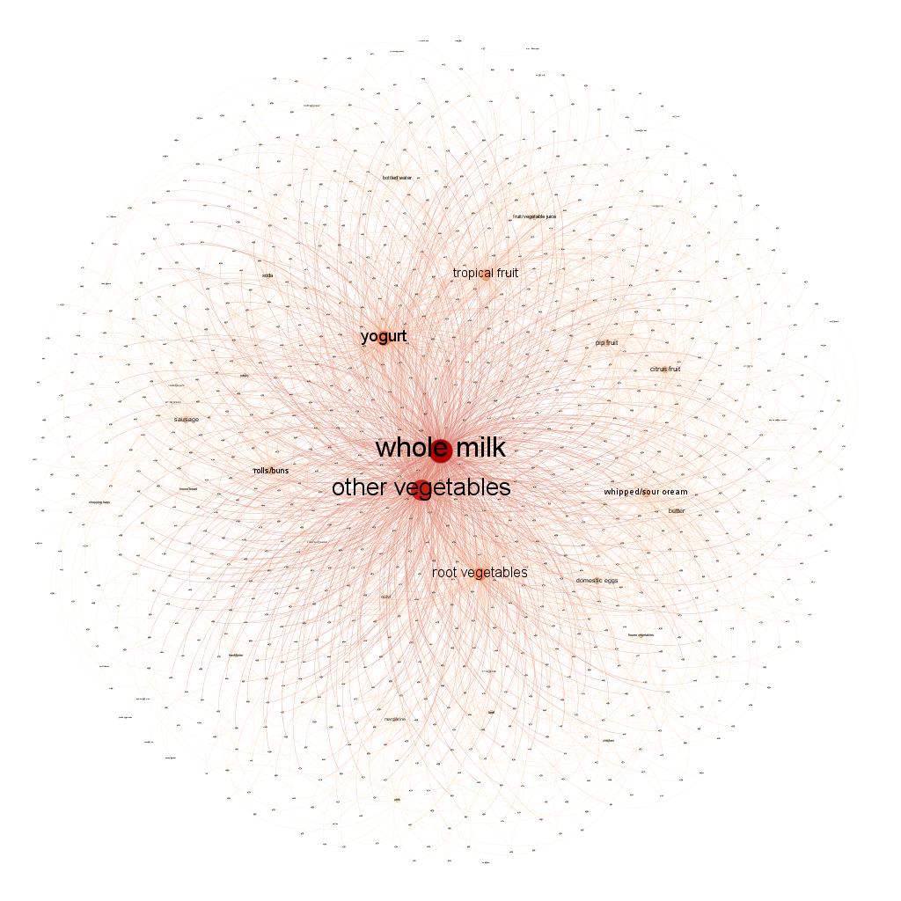

# Problem 1:

## Exploration and Charts that aren't the final story 

```{r setup}
rm(list=ls())
library(randomForest)
library(ggplot2)
library(tidyverse)
library(dplyr)
bd <- read.csv("greenbuildings.csv",header=TRUE, sep=",")
hist(bd$Rent)
bd[!complete.cases(bd), ]  #empl_gr has mainly entries that have NA values
bdrf = bd %>% drop_na('empl_gr') #just in case
rmse <- function(y,yhat){return((mean((y - yhat)^2))^0.5)}
summary(bdrf)
```

As this data is a a mix of categorial numerical it seems worthwhile to approach this with random forest to try and determine importance of variables to begin analysis.

```{r}
set.seed(10) #for 10/10
# train/test setup
test.n = floor(dim(bd)[1]*0.2)
test = sample(1:dim(bd)[1], test.n)
train = -test
ctrain=bdrf[train,]
ctest=bdrf[test,]

p=ncol(ctrain)-1
mtryv = c(floor(sqrt(p))-2,floor(sqrt(p)),floor(sqrt(p))+5,p) #m=p is bagging case
ntreev = c(10,25,50)

parmrf = expand.grid(mtryv,ntreev)
colnames(parmrf)=c('mtry','ntree')
nset = nrow(parmrf)

olrf = rep(0,nset)
ilrf = rep(0,nset)

rffits = vector('list',nset)

for(i in 1:nset) {
  tempr = randomForest(Rent~.,data=ctrain,mtry=parmrf[i,1],ntree=parmrf[i,2])
  rf.ipr = predict(tempr)
  rf.opr=  predict(tempr,newdata=ctest)
  olrf[i] = rmse(ctest$Rent,rf.opr)
  rffits[[i]]=tempr
}

print(cbind(parmrf,olrf))

```

```{r}
iirf=which.min(olrf)
print(cbind(iirf))
# rf = rffits[[iirf]] #rf with best particular set of parameters
nrow(rffits)
varImpPlot(rffits[[11]])
# Best was Number of trees: 50
# No. of variables tried at each split: 9
```

To build an intuition, so far it looks like we're going to have to poke out any interesting relations for Energy star. Clearly our location has the largest predictive power, so much so it likely drowns out many other results.

For this reason I'm subtracting it from the rent for an adjusted rent so we can try to sort out other relationships.

```{r}
bd$AdjRent = bd$Rent-bd$cluster_rent
print(summary(bd$size))
print(summary(bd$cluster))
```


```{r}
ggplot(bd, aes(cluster,cluster_rent)) +
  geom_point(aes(color = class_a)) +
  geom_smooth(method='lm',col='red') 
# Neighborhood=factor(mc$Nbhd)
# ggplot(mc, aes(size,AdjRent)) +
#   geom_point(aes(color = cluster )) +
#   geom_smooth(method='lm',col='red') +
# geom_smooth(aes(group=Neighborhood,color=Neighborhood),method='lm',se = FALSE) +
#   labs(title = "Sq.Ft. and Effect on Price per Neighborhood") 
```

So there are a large number of cheap good (class_a) houses throughout the distribution. Our cluster actually has a region of missing values, so treating it ordinally is dangerous. Also the cluster value is randomly placed. Let's regroup these clusters.

```{r}
bd=bd[order(bd$cluster_rent),]
# select every 20 clusters by their relative rent averages to create a bin
bins_break=c(unique(bd$cluster_rent))[seq(1,411,40)]
minibins_break=c(unique(bd$cluster_rent))[seq(1,411,8)]
bin_assign <- function(x){
  for (i in seq(1,length(bins_break))){
    if (x<=bins_break[i]){
       return(i)
    }
  }
  return(length(bins_break)+1)
}
minibin_assign <- function(x){
  for (i in seq(1,length(minibins_break))){
    if (x<=minibins_break[i]){
       return(i)
    }
  }
  return(length(minibins_break)+1)
}
bd$bin = sapply(X=bd$cluster_rent,bin_assign)
bd$minibin = sapply(X=bd$cluster_rent,minibin_assign)
# now we reorder so that our bin has green as last points in bins for easy visualizations
bd2=bd[order(bd$bin,bd$green_rating),]

```

```{r}
ggplot(bd, aes(bin,cluster_rent)) +
  geom_point(aes(color = class_a,),alpha=.2) +
  geom_smooth(method='lm',col='red') 
```
Much cleaner way to start looking at our data.

```{r warning=FALSE, message=FALSE}
ggplot(bd2, aes(minibin,Rent)) +
  geom_point(aes(color =factor(green_rating)  )) +
  geom_smooth(aes(group= factor(green_rating),color= factor(green_rating)))+
  scale_color_manual(breaks = c("0", "1"),
                        values=c("grey", "darkgreen"))+
  labs(title = "Rent binned by similarly priced neighborhoods") 

ggplot(bd2, aes(minibin,AdjRent)) +
  geom_point(aes(color =factor(green_rating)  )) +
  geom_smooth(aes(group= factor(green_rating),color= factor(green_rating))) +
  scale_color_manual(breaks = c("0", "1"),
                        values=c("grey", "darkgreen"))+
labs(title = "Adjusted Rent Factoring for Location") 
```

In expensive neighborhoods house price fluctuate more, though we binned along an ensemble term like the local mean we operate in a nearly linear regime until reach the highend, where not only size increases but the size per sq ft also does the same.The average green at a cursory look seems to make a small premium when compared at every point, however sorting out if that's significant is a different story. 

```{r warning=FALSE, message=FALSE}

for (i in 1:12){
 plt <- ggplot(bd2[bd2['bin']==i,], aes(size,Rent)) +
  geom_point(aes(color =factor(green_rating)  )) +
  geom_smooth(aes(group= factor(green_rating),color= factor(green_rating)),method='lm')+
  scale_color_manual(breaks = c("0", "1"),
                        values=c("grey", "darkgreen"))+
    labs(title = "Rental Rate of Apartments by Size",subtitle = i ,rows=2) 
  print(plt)
  }
```
It seems that larger developments may actually suffer from lower rent rates, though leverage of from mega-complexes with no regard for environmental policy might be scewing that, lets remove really big projects.

```{r}
ggplot(bd2[bd2['size']<1750000,], aes(size,Rent)) +
  geom_point(aes(color =factor(green_rating)  )) +
  geom_smooth(aes(group= factor(green_rating),color= factor(green_rating)),method='lm')+
  scale_color_manual(breaks = c("0", "1"),
                        values=c("darkgrey", "darkgreen"))+
  facet_wrap(~ renovated, labeller=label_both)
```

Leverage doesn't explain away the poor rental rates for green houses sans renovation. Maybe it's time we examine the performance of these properties and if there are a lot of spaces being left open. 

```{r}
ggplot(bd2[bd2['size']<1750000,], aes(bin,leasing_rate)) +
  geom_point(aes(color =factor(green_rating)  )) +
  geom_smooth(aes(group= factor(green_rating),color= factor(green_rating)))+
  scale_color_manual(breaks = c("0", "1"),
                        values=c("darkgrey", "darkgreen"))+
  facet_grid( ~ amenities,labeller = label_both )+
  labs(title = "Leasing Rate of Apartments by Size",rows=2) 

```
So across all bins (socioecomic and regional brackets) it seems that these apartments generally are more popular and more filled, which is the first bit of reassuring news that's come our way. We can see that part of this is likely due to the amenities that green constructions tend to offer at a higher rate then the average complex. Amenities really help get that last half of open rooms filled up for large projects.  

```{r}
# # New facet label names for amen variable
# amen.labs <- c("0", "", "D2")
# names(amen.labs) <- c("0.5", "1", "2")
# 
# # New facet label names for supp variable
# supp.labs <- c("Orange Juice", "Vitamin C")
# names(supp.labs) <- c("OJ", "VC")

ggplot(bd2[bd2['size']<1750000,], aes(bin,leasing_rate)) +
  geom_point(aes(color =factor(green_rating)  )) +
  geom_smooth(aes(group= factor(green_rating),color= factor(green_rating)),method = 'lm')+
  scale_color_manual(breaks = c("0", "1"),
                        values=c("darkgrey", "darkgreen"))+
  facet_grid(renovated ~ amenities,labeller = label_both )+
  labs(title = "Leasing Rate of Apartments by Size",rows=2) 
```

Bottom left chart has little use for interpretation due to a lack of data, as evidenced by large error. In general we see that a well maintained facility with good amenities seems to get filled. Without these the green certified buildings seem to have an advantage. 


```{r}
abc <- function(a,b){
  return(2*a+b)
}
map = setNames(c("Class A", "Class B", "Class C",""), c(0, 1, 2, NA))
tmp=abc(bd$class_a,bd$class_b)
tmp <- replace(tmp, tmp == NA, "")
tmp <- replace(tmp, tmp == "1", "Class B")
tmp <- replace(tmp, tmp == "0", "Class C")
tmp <- replace(tmp, tmp == "2", "Class A")
bd2$class=tmp

# Nothing interprable or easy to see here.
# ggplot(bd2, aes(age,Rent)) +
#   geom_point(aes(color =factor(green_rating)  )) +
#   geom_smooth(aes(group= factor(green_rating),color= factor(green_rating)))+
#   scale_color_manual(breaks = c("0", "1"),
#                         values=c("darkgrey", "darkgreen"))+
#   scale_x_reverse()+
#   facet_grid(renovated ~ amenities,labeller = label_both )+
#   labs(title = "Leasing Rate of Apartments by Size",rows=2) 
ggplot(bd2, aes(class,fill =factor(green_rating))) +
  geom_bar(position='fill')+
    scale_fill_manual(breaks = c("0", "1"),
                        values=c("darkgrey", "darkgreen"))+
  facet_grid(renovated ~ amenities,labeller = label_both )+
  labs(title = "Leasing Rate of Apartments by Size",rows=2)

```
It doesn't really seem that green apartments are overrepresented in class A insofar as their class skews leasing rate. It really does seem that in general these apartments tend to retain higher occupancy rates, especially in lower cost neighborhoods, though this doesn't actually translate into higher rental prices per occupancy.

In short, when competing with scale apartments the average occupancy rate might offset costs, but depending on how upscale the neighborhood one is in that disincentivises the ROI on going green. Since the final amount of money making its way to the developer is occupancy rate times price times size lets wrap up with that chart.

```{r}
ggplot(bd2[bd2['size']<1750000,], aes(bin,leasing_rate*AdjRent/100)) +
  geom_point(aes(color =factor(green_rating)  )) +
  geom_smooth(aes(group= factor(green_rating),color= factor(green_rating)),method = 'lm')+
  scale_color_manual(breaks = c("0", "1"),
                        values=c("darkgrey", "darkgreen"))+
  facet_grid(renovated ~ amenities,labeller = label_both )+
  labs(title = "Adjusted Rental Rate of Apartments by Size",rows=2) 
```

### These slight improvements in property performance fail to justify a 5% upfront investment, especially the larger and grander this development project becomes.


# Problem 2: ABIA

```{r }
rm(list=ls())
library(ggplot2)
library(tidyverse)
rm(list=ls())
df<-read.csv('ABIA.csv')
```


```{r}
# inspect data
head(df[df$ArrDelay<0,])
print(table(df[df$ArrDelay<0,]$UniqueCarrier))
print(table(df$UniqueCarrier))
df = df %>% drop_na('UniqueCarrier')
```

```{r}
# organize our data chronologically
df=df[order(df$Month,df$DayofMonth,df$DepTime),]


# Make an interpretable month column
mymonths <- c("January","February","March",
              "April","May","June",
              "July","August","September",
              "October","November","December")

df$MonthName <- mymonths[ df$Month ]

dffd=df[df$DepDelay>0,]
dffd = dffd %>% drop_na('UniqueCarrier')
dffd = dffd %>% drop_na('DepDelay')
unique(dffd$MonthName)
summary(dffd)

```
## The plot:
We have a histogram facetted by month, of all the mid-size carriers and late departures with a colormap of how tardy the respective flight was. As the data is ordered by month, each bar roughly provides a month long timeline of their ability to serve customers with an expedient flying experience. The color intensity from black to yellow  


```{r}
late_breaks=c(0,15,60,120,300)
early_breaks=c(0,15,30)
for (i in 1:12){
 plt <- ggplot(dffd[dffd$Month==i & dffd$UniqueCarrier!="WN" & dffd$UniqueCarrier!="AA" & dffd$UniqueCarrier!="CO",],aes(x=UniqueCarrier,y=1,fill=DepDelay,))+
  geom_col()+
  coord_flip()+
  scale_fill_gradientn(breaks=late_breaks,labels=late_breaks,limits=c(0,150),colours=c('black','yellow','orange','red','darkred'))+
   facet_wrap(~ MonthName,ncol=1)
 print(plt)
  }
  
```

## Problem 3: Portfolio modeling
```{r warning=FALSE}
rm(list=ls())
library(mosaic)
library(quantmod)
library(foreach)
```
Real Estate Stock Portfolio
```{r echo=FALSE}
mystocks = c("VNQ", "SCHH", "IYR")
myprices = getSymbols(mystocks, from = "2014-07-01")

# A chunk of code for adjusting all stocks
# creates a new object adding 'a' to the end
# For example, WMT becomes WMTa, etc
for(ticker in mystocks) {
	expr = paste0(ticker, "a = adjustOHLC(", ticker, ")")
	eval(parse(text=expr))
}

head(VNQ)

# Combine all the returns in a matrix
all_returns = cbind(	ClCl(VNQa),
								ClCl(SCHHa),
								ClCl(IYRa))
head(all_returns)
all_returns = as.matrix(na.omit(all_returns))
```
```{r}
initial_wealth = 100000
sim1 = foreach(i=1:5000, .combine='rbind') %do% {
	total_wealth = initial_wealth
	weights = c((1/3), (1/3),(1/3))
	holdings = weights * total_wealth
	n_days = 20
	wealthtracker = rep(0, n_days)
	for(today in 1:n_days) {
		return.today = resample(all_returns, 1, orig.ids=FALSE)
		holdings = holdings + holdings*return.today
		total_wealth = sum(holdings)
		wealthtracker[today] = total_wealth
	}
	wealthtracker
}

hist(sim1[,n_days], 25)
```
The above is the distribition of the bootstrap models of the porfolio's performance over a 2 week period. The below is the same histogram with only looking at total profit and loss.

```{r}
# Profit/loss
hist(sim1[,n_days]- initial_wealth, breaks=30)
```
```{r warning=FALSE}
library(PerformanceAnalytics)
VaR(all_returns, p=0.95, weights = weights, portfolio_method = 'component', method='historical')
```
$hVar 95% = 0.01588 which means in the worst 5% for cases, 1.6% of our entire portfolio is at risk.
VNQ accounts for 33.8%, SCHH for 34.7%, and IYR for 31.7% ofthe risk.

A Portfolio of ETFs a friend of mine has been involved with:
```{r}
mystocks = c("SPY", "VOO", "PE")
myprices = getSymbols(mystocks, from = "2014-07-01")

for(ticker in mystocks) {
	expr = paste0(ticker, "a = adjustOHLC(", ticker, ")")
	eval(parse(text=expr))
}

# Combine all the returns in a matrix
all_returns = cbind(	ClCl(SPYa),
								ClCl(VOOa),
								ClCl(PEa))
all_returns = as.matrix(na.omit(all_returns))
```

```{r}
initial_wealth = 100000
sim2 = foreach(i=1:5000, .combine='rbind') %do% {
	total_wealth = initial_wealth
	weights = c((1/3), (1/3),(1/3))
	holdings = weights * total_wealth
	n_days = 20
	wealthtracker = rep(0, n_days)
	for(today in 1:n_days) {
		return.today = resample(all_returns, 1, orig.ids=FALSE)
		holdings = holdings + holdings*return.today
		total_wealth = sum(holdings)
		wealthtracker[today] = total_wealth
	}
	wealthtracker
}

head(sim2)
hist(sim2[,n_days], 25)
```
The above is the distribition of the bootstrap models of the porfolio's performance over a 2 week period. The below is the same histogram with only looking at total profit and loss.
```{r}
# Profit/loss
mean(sim2[,n_days])
hist(sim2[,n_days]- initial_wealth, breaks=30)
```

```{r}
VaR(all_returns, p=0.95, weights = weights, portfolio_method = 'component', method='historical')
```

$hVar 95% = 0.0199 which means in the worst 5% for cases, 1.9% of our entire portfolio is at risk.
SPY accounts for 18.8%, VOO for 18.9%, and PE for 62.2% ofthe risk.

A portfolio of random ETFs:
```{r}
mystocks = c("CPE", "GLP", "CUZ")
myprices = getSymbols(mystocks, from = "2014-07-01")

for(ticker in mystocks) {
	expr = paste0(ticker, "a = adjustOHLC(", ticker, ")")
	eval(parse(text=expr))
}

# Combine all the returns in a matrix
all_returns = cbind(	ClCl(CPEa),
								ClCl(GLPa),
								ClCl(CUZa))
all_returns = as.matrix(na.omit(all_returns))
```

```{r}
initial_wealth = 100000
sim3 = foreach(i=1:5000, .combine='rbind') %do% {
	total_wealth = initial_wealth
	weights = c((1/3), (1/3),(1/3))
	holdings = weights * total_wealth
	n_days = 20
	wealthtracker = rep(0, n_days)
	for(today in 1:n_days) {
		return.today = resample(all_returns, 1, orig.ids=FALSE)
		holdings = holdings + holdings*return.today
		total_wealth = sum(holdings)
		wealthtracker[today] = total_wealth
	}
	wealthtracker
}

hist(sim3[,n_days], 25)
```
The above is the distribition of the bootstrap models of the porfolio's performance over a 2 week period. The below is the same histogram with only looking at total profit and loss.
```{r}
# Profit/loss
hist(sim3[,n_days]- initial_wealth, breaks=30)
```

```{r}
VaR(all_returns, p=0.95, weights = weights, portfolio_method = 'component', method='historical')
```
$hVar 95% = 0.02729693 which means in the worst 5% for cases, 2.7% of our entire portfolio is at risk.
CPE accounts for 50.8%, GLP for 24.8%, and CUZ for 24.4% ofthe risk.

Based on this information, I would use the first set of three because the value at risk for the worst 5% of cases is the least.  Of course, there are many other factors to consider. For example, if I was less concerned about risk, I might care more about potential gains and make my decsions based on that, but I'm assuming this investor is cautious since we are attempting to look at VaR.


# Problem 4: Market Segmentation
```{r}
rm(list=ls())

df = read.csv('social_marketing.csv.txt')
```

```{r echo=FALSE}
# Center/scale the data 
df.scaled = subset(df, select = -c(X) )
df.scaled = df.scaled/rowSums(df.scaled)
df.scaled = subset(df.scaled, select = -c(chatter, uncategorized))
```

```{r}
# PCA - With no rank
PCA = prcomp(df.scaled, scale=TRUE)
plot(PCA)
```
I chose 5 for the "elbow" and rank.
```{r}
pc5 = prcomp(df.scaled, scale=TRUE, rank=5)
loadings = pc5$rotation
scores = pc5$x
```

Head of Component 1
```{r}
# The top words associated with each component

o1 = order(loadings[,1], decreasing=TRUE)
colnames(df.scaled)[head(o1,5)]
```
Tail of Component 1
```{r}
colnames(df.scaled)[tail(o1,5)]
```
Head of Component 2
```{r}
o2 = order(loadings[,2], decreasing=TRUE)
colnames(df.scaled)[head(o2,5)]
```
Tail of Component 2
```{r}
colnames(df.scaled)[tail(o2,5)]
```

```{r include=FALSE}
o3 = order(loadings[,3], decreasing=TRUE)
colnames(df.scaled)[head(o3,5)]
colnames(df.scaled)[tail(o3,5)]
```
Based on what was found in the above PCA, I believe the cluster of people that is most active on social media for NutrientH20 is what some might call "suburban parents".  Religion, sports, parenting and school were all at the head of the first component of PCA, with things such as cooking, personal fitness, and health and nutrition following in the second component.  These are all things which are important to many suburban parents.  The tails seemed to solidify that to me as well, as fashion, photo sharing, politics, travel,  and college and univerity were in the first and second components.  Those seem to be the types of things that younger single people are interested in.  OF course thise whole thing is highly subjective, but based on what I ran here, it is what I would go with.

# Problem 5: Author Attribution

```{r  include=FALSE}
knitr::opts_chunk$set(echo = TRUE)
```

```{r}
library(tm) 
library(magrittr)
library(slam)
library(proxy)
library(glmnet)
library(randomForest)

rm(list=ls())

```


Creating a list of Authors from the directories
```{r}
list_authors = list.dirs(path="data/ReutersC50/C50train",full.names = FALSE)[2:51]
```


Using the readerPlain function created by Dr. Scott
```{r}
readerPlain = function(fname){
  readPlain(elem=list(content=readLines(fname)), 
            id=fname, language='en') }
```


Creating file and class labels for train and test
Looping over the list of authors to do it for each author
```{r}
files_all_train = vector()
class_labels_train = vector()
for (author in list_authors){
  file_list_author = Sys.glob(paste0('data/ReutersC50/C50train/',author,'/*.txt'))
  assign(paste0("file_list_",author), get("file_list_author"))
  files_all_train = append(files_all_train,file_list_author)
  class_labels_train = append(class_labels_train,rep(paste0(author),50))
}

files_all_test = vector()
class_labels_test = vector()
for (author in list_authors){
  file_list_author = Sys.glob(paste0('data/ReutersC50/C50test/',author,'/*.txt'))
  assign(paste0("file_list_",author), get("file_list_author"))
  files_all_test = append(files_all_test,file_list_author)
  class_labels_test = append(class_labels_test,rep(paste0(author),50))
}

```


Creating test and train set
```{r}
y_test = class_labels_test
y_train = class_labels_train
docs_train = lapply(files_all_train,readerPlain)
docs_test = lapply(files_all_test,readerPlain)

```


Cleaning names
```{r}
mynamestrain = files_all_train %>%
  { strsplit(., '/', fixed=TRUE) } %>%
  { lapply(., tail, n=2) } %>%
  { lapply(., paste0, collapse = '') } %>%
  unlist

mynamestest = files_all_test %>%
  { strsplit(., '/', fixed=TRUE) } %>%
  { lapply(., tail, n=2) } %>%
  { lapply(., paste0, collapse = '') } %>%
  unlist

```


Renaming the articles with the cleaned names
```{r}
names(docs_train) = mynamestrain
names(docs_test) = mynamestest

```

Creating Corpora
```{r}
documents_raw_train = Corpus(VectorSource(docs_train))
documents_raw_test = Corpus(VectorSource(docs_test))

```

Some pre-processing/tokenization steps.

Train
```{r}
my_documents_train = documents_raw_train
my_documents_train = tm_map(my_documents_train, content_transformer(tolower)) # make everything lowercase
my_documents_train = tm_map(my_documents_train, content_transformer(removeNumbers)) # remove numbers
my_documents_train = tm_map(my_documents_train, content_transformer(removePunctuation)) # remove punctuation
my_documents_train = tm_map(my_documents_train, content_transformer(stripWhitespace)) ## remove excess white-space
my_documents_train = tm_map(my_documents_train, content_transformer(removeWords), stopwords("en"))## Remove stopwords.

```

Test
```{r}
my_documents_test = documents_raw_test
my_documents_test = tm_map(my_documents_test, content_transformer(tolower)) # make everything lowercase
my_documents_test = tm_map(my_documents_test, content_transformer(removeNumbers)) # remove numbers
my_documents_test = tm_map(my_documents_test, content_transformer(removePunctuation)) # remove punctuation
my_documents_test = tm_map(my_documents_test, content_transformer(stripWhitespace)) ## remove excess white-space
my_documents_test = tm_map(my_documents_test, content_transformer(removeWords), stopwords("en"))## Remove stopwords.
```


Create a doc-term-matrix for test
```{r}
DTM_docs_train = DocumentTermMatrix(my_documents_train)
```


Remove Sparse Terms
```{r}
DTM_docs_train = removeSparseTerms(DTM_docs_train, 0.95)

```


Create a doc-term-matrix for test using only words in train
```{r}
DTM_docs_test = DocumentTermMatrix(my_documents_test,control = list(dictionary=Terms(DTM_docs_train)))
```

                                   
Construct TF IDF weights
```{r}
tfidf_docs_train = weightTfIdf(DTM_docs_train)
tfidf_docs_test = weightTfIdf(DTM_docs_test)

X_tr = as.matrix(tfidf_docs_train)
summary(colSums(X_tr))
scrub_cols = which(colSums(X_tr) == 0)
X_tr = X_tr[,-scrub_cols]

X_te = as.matrix(tfidf_docs_test)
summary(colSums(X_te))
scrub_cols = which(colSums(X_te) == 0)
X_te = X_te[,-scrub_cols]

```


PCA on training data
```{r}
pc_reuters_train = prcomp(X_tr, scale=FALSE)
plot(pc_reuters_train)

```


Number of Components used - there is huge dimensionality reduction being carried out here as only 100 PCs are used. The initial word list was much larger than this.
```{r}
Nn = 100
X_train = pc_reuters_train$x[,1:Nn]

```


Creating PCs of test data
```{r}
train.data <- data.frame(Author=y_train, pc_reuters_train$x)

```


We are interested in first Nn PCAs
```{r}
train.data <- train.data[,1:(Nn+1)]

```


Transform test into PCA through random forest
```{r}
randomforest.model <- randomForest(Author ~ .,data = train.data, method = "anova",family="multinomial")
randomforest.model
test.data <- predict(pc_reuters_train, newdata = X_te)
test.data <- as.data.frame(test.data)

```


Select the first Nn components
```{r}
test.data <- test.data[,1:Nn]
X_test = as.matrix(test.data)

```


Predicting on the Test Set
```{r}
yhat_test <- predict(randomforest.model, test.data)
confusion_matrix = xtabs(~y_test + yhat_test)

```


Compute the error rate
```{r}
1-sum(diag(confusion_matrix))/length(yhat_test)

```
The resulting model has an error rate of less than 49% which means that the model is correct more than 50% of the time which is a significant improvement on the baseline accuracy of 2%.

# Problem 6: 


```{r include=FALSE}
knitr::opts_chunk$set(echo = TRUE)
```

```{r}
library(tidyverse)
library(arules)
library(arulesViz)

rm(list = ls())
```

Importing the data
```{r}

groceries_raw = read.delim2("data/groceries.txt",header=FALSE)
N = dim(groceries_raw)[1]
Basket_number=1:N
```

Modifying the columns to make them more understandable and workable
```{r}
groceries_raw$BN = Basket_number
groceries_raw <- groceries_raw[c(2,1)]
colnames(groceries_raw)[colnames(groceries_raw)=="V1"] <- "Basket"
groceries_raw <- data.frame(lapply(groceries_raw, as.character), stringsAsFactors=FALSE)

```

Converting the columns to rows with the basket name still intact
```{r}
s <- strsplit(groceries_raw$Basket, split = ",")
groceries_raw2 = data.frame(V1 = rep(groceries_raw$BN, sapply(s, length)), V2 = unlist(s))
colnames(groceries_raw2)[colnames(groceries_raw2)=="V1"] <- "BN"
colnames(groceries_raw2)[colnames(groceries_raw2)=="V2"] <- "Basket"
str(groceries_raw2)

```


First split data into a list of items for each basket
```{r}
baskets = split(x=groceries_raw2$Basket, f=groceries_raw2$BN)

```


Remove duplicates ("de-dupe")
```{r}
baskets = lapply(baskets, unique)
```


Cast this variable as a special arules "transactions" class.
```{r}
basketstrans = as(baskets, "transactions")
summary(basketstrans)

```

Now run the 'apriori' algorithm
Look at rules with support > .005 & confidence >.1 & length (# products) <= 5
```{r}
groceryrules = apriori(basketstrans, 
                     parameter=list(support=.005, confidence=.1, maxlen=5))

```


Inspecting the data to find some interesting insights
```{r}
inspect(subset(groceryrules, subset=lift > 4))

```
As it is visible only 4 rules have a lift more than 4. White bread seems to have a high lift with ham. It could be related to be people wanting to prepare ham sandwiches. 
```{r}
inspect(subset(groceryrules, subset=confidence > 0.6))

```

As it is visible, whole milk seems to show a high confidence with a lot of products. It is associated with the fact the P(whole milk) is high in itself.

```{r}
inspect(subset(groceryrules, subset=lift > 4 & confidence > 0.4))

```

As it is visible only 4 rules have a lift more than 4 while having a confidence more than 0.4. Looking at the fourth one, we can see some logic.
People who buy citrus fruit, other vegetables and whole milk are likely to buy root vegetables as all of these items belong to the produce section and are associated with healthy eating. 


plot all the rules in (support, confidence) space
notice that high lift rules tend to have low support
```{r}
plot(groceryrules)
```


can swap the axes and color scales
```{r}
plot(groceryrules, measure = c("support", "lift"), shading = "confidence")
```


"Two key" plot: coloring is by size (order) of item set
```{r}
plot(groceryrules, method='two-key plot')

```


Graph-based visualization
```{r}
sub1 = subset(groceryrules, subset=confidence > 0.01 & support > 0.005)
summary(sub1)
plot(sub1, method='graph')

plot(head(sub1, 100, by='lift'), method='graph')

```

Export  for Gephi
```{r}
saveAsGraph(head(groceryrules, n = 1000, by = "lift"), file = "groceryrules.graphml")

```


Gephi modified output

As you can see in this graph, whole milk and other vegetables have the highest degree and represent the holes for this network. This behavior can be expected as whole milk and vegetables are frequently purchased items and are part of most baskets due to their low shelf life and perishability.

