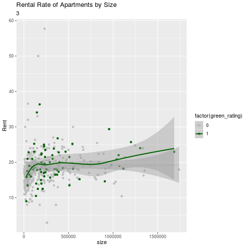
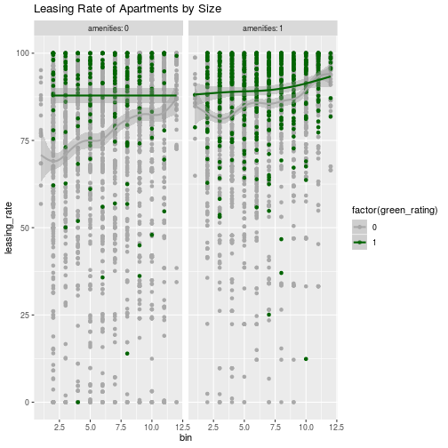
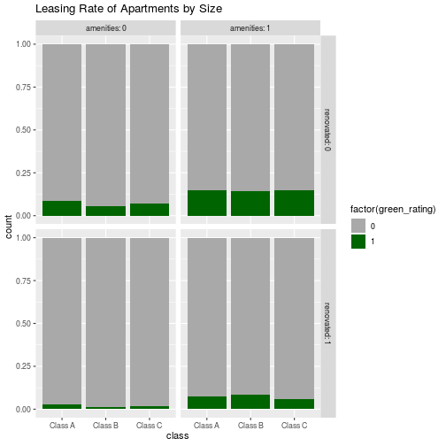
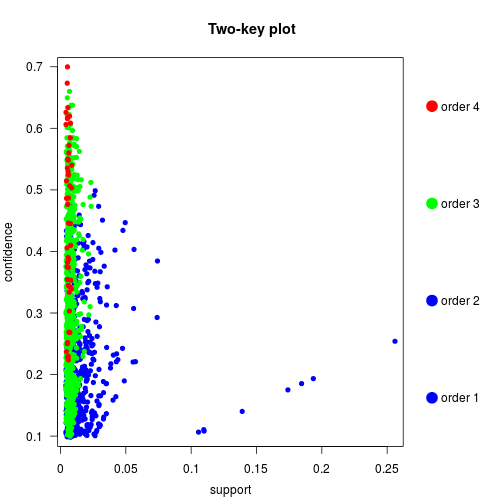
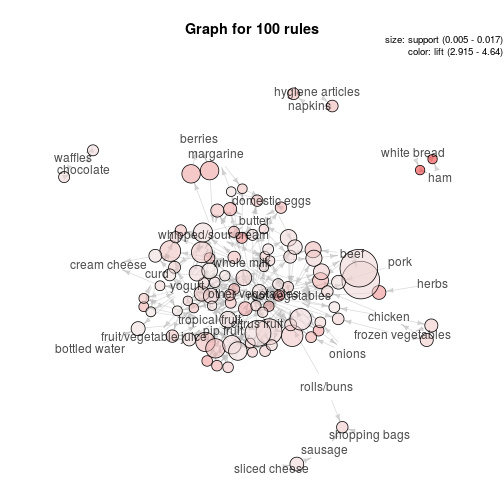

# Problem 1:

## Exploration and Charts that aren't the final story 


```r
rm(list=ls())
library(randomForest)
library(ggplot2)
library(tidyverse)
library(dplyr)
bd <- read.csv("greenbuildings.csv",header=TRUE, sep=",")
hist(bd$Rent)
```


```r
bd[!complete.cases(bd), ]  #empl_gr has mainly entries that have NA values
```

```
##      CS_PropertyID cluster   size empl_gr  Rent leasing_rate stories age
## 198        1212036      20 385469      NA 17.97        99.49      14  20
## 199        1211872      20 127982      NA 15.00        82.27      18  86
## 200        1212027      20  63150      NA 15.00        66.22       6  85
## 201        1216881      20  98725      NA 15.54        85.82       6  97
## 202        1211896      20   3000      NA 16.00        50.00       4 127
## 203        1216662      20  13100      NA 16.00        11.05       1  45
## 204        1211247      20 850000      NA 16.50        95.90      11  90
## 205        1211853      20  70377      NA 18.00        75.39       6  45
## 206        1215535      20 300000      NA 18.00        63.40      27  40
## 207        1216862      20 309686      NA 18.62        86.14       8  81
## 208        1183800      20 330901      NA 19.34        97.65      30  18
## 209        1211834      20 187190      NA 20.00        94.66       9  52
## 210        1211865      20 598540      NA 20.61        96.79      26  33
## 211        1215530      20 281189      NA 20.80        72.37      17  18
## 212        1211751      20 391234      NA 21.50        42.60      23  26
## 213         826141      20 673061      NA 21.98        85.07      29  23
## 214        1211897      20 108000      NA 22.00         0.00       3   1
## 215        1215914      20 818000      NA 22.58        95.51      38  27
## 216        1212003      20 221410      NA 23.00        58.23      18  45
## 217        1211838      20 258721      NA 24.00        86.82      20  44
## 218        1152870      20 379914      NA 24.50        95.90      14  20
## 219        1215918      20 277120      NA 24.53        73.35      18  18
## 2586       1211824     328 411982      NA 25.00        94.11      24  24
## 2587       1211872     328 127982      NA 15.00        82.27      18  86
## 2588       1212027     328  63150      NA 15.00        66.22       6  85
## 2589       1216662     328  13100      NA 16.00        11.05       1  45
## 2590       1211853     328  70377      NA 18.00        75.39       6  45
## 2591       1215535     328 300000      NA 18.00        63.40      27  40
## 2592       1211865     328 598540      NA 20.61        96.79      26  33
## 2593       1212003     328 221410      NA 23.00        58.23      18  45
## 2594       1211838     328 258721      NA 24.00        86.82      20  44
## 2595       1152870     328 379914      NA 24.50        95.90      14  20
## 3784        529470     456 135276      NA 34.00        79.77       4   6
## 3785        214381     456  24000      NA 18.00        78.33       3  25
## 3786        214360     456 125000      NA 32.00        73.75       4  18
## 3787        214693     456 119702      NA 32.00        95.75       4   9
## 4820        222127     552 364780      NA 55.94        94.00      23  22
## 4821        222216     552  74533      NA 13.00        90.99      10  95
## 4822        223125     552 750000      NA 20.10        98.06      35  14
## 4823        222136     552  14401      NA 22.45        85.65       4 107
## 4824        222856     552  20660      NA 24.00        84.03       6  97
## 4825        222176     552 229843      NA 24.70        76.99      11 104
## 4826          9936     552  23883      NA 25.00        80.69       7 149
##      renovated class_a class_b LEED Energystar green_rating net amenities
## 198          1       1       0    0          1            1   0         1
## 199          0       0       1    0          0            0   0         1
## 200          0       0       1    0          0            0   0         1
## 201          0       0       1    0          0            0   0         0
## 202          0       0       1    0          0            0   0         0
## 203          1       0       1    0          0            0   0         0
## 204          0       1       0    0          0            0   0         1
## 205          0       0       1    0          0            0   0         1
## 206          0       0       1    0          0            0   0         1
## 207          1       0       1    0          0            0   0         0
## 208          0       1       0    0          0            0   0         0
## 209          0       0       1    0          0            0   0         1
## 210          1       1       0    0          0            0   0         1
## 211          0       1       0    0          0            0   0         1
## 212          0       1       0    0          0            0   0         1
## 213          0       1       0    0          0            0   0         1
## 214          0       0       1    0          0            0   0         0
## 215          0       1       0    0          0            0   0         1
## 216          1       1       0    0          0            0   0         1
## 217          0       1       0    0          0            0   0         1
## 218          1       1       0    0          0            0   0         0
## 219          0       1       0    0          0            0   0         1
## 2586         0       1       0    0          1            1   0         1
## 2587         0       0       1    0          0            0   0         1
## 2588         0       0       1    0          0            0   0         1
## 2589         1       0       1    0          0            0   0         0
## 2590         0       0       1    0          0            0   0         1
## 2591         0       0       1    0          0            0   0         1
## 2592         1       1       0    0          0            0   0         1
## 2593         1       1       0    0          0            0   0         1
## 2594         0       1       0    0          0            0   0         1
## 2595         1       1       0    0          0            0   0         0
## 3784         0       1       0    0          1            1   0         1
## 3785         0       0       1    0          0            0   0         0
## 3786         0       1       0    0          0            0   0         1
## 3787         0       1       0    0          0            0   0         1
## 4820         0       1       0    0          1            1   0         1
## 4821         1       0       1    0          0            0   0         0
## 4822         0       1       0    0          0            0   0         1
## 4823         1       0       0    0          0            0   0         1
## 4824         1       0       1    0          0            0   0         0
## 4825         1       0       1    0          0            0   0         1
## 4826         1       0       1    0          0            0   0         0
##      cd_total_07 hd_total07 total_dd_07 Precipitation  Gas_Costs
## 198          921       5908        6829         58.02 0.01340000
## 199          921       5908        6829         58.02 0.01342547
## 200          921       5908        6829         58.02 0.01342547
## 201          921       5908        6829         58.02 0.01342547
## 202          921       5908        6829         58.02 0.01342547
## 203          921       5908        6829         58.02 0.01342547
## 204          921       5908        6829         58.02 0.01342547
## 205          921       5908        6829         58.02 0.01342547
## 206          921       5908        6829         58.02 0.01342547
## 207          921       5908        6829         58.02 0.01342547
## 208          921       5908        6829         58.02 0.01342547
## 209          921       5908        6829         58.02 0.01342547
## 210          921       5908        6829         58.02 0.01342547
## 211          921       5908        6829         58.02 0.01342547
## 212          921       5908        6829         58.02 0.01342547
## 213          921       5908        6829         58.02 0.01342547
## 214          921       5908        6829         58.02 0.01342547
## 215          921       5908        6829         58.02 0.01342547
## 216          921       5908        6829         58.02 0.01342547
## 217          921       5908        6829         58.02 0.01342547
## 218          921       5908        6829         58.02 0.01342547
## 219          921       5908        6829         58.02 0.01342547
## 2586         921       5908        6829         58.02 0.01340000
## 2587         921       5908        6829         58.02 0.01342547
## 2588         921       5908        6829         58.02 0.01342547
## 2589         921       5908        6829         58.02 0.01342547
## 2590         921       5908        6829         58.02 0.01342547
## 2591         921       5908        6829         58.02 0.01342547
## 2592         921       5908        6829         58.02 0.01342547
## 2593         921       5908        6829         58.02 0.01342547
## 2594         921       5908        6829         58.02 0.01342547
## 2595         921       5908        6829         58.02 0.01342547
## 3784         892       5666        6558         54.91 0.01550000
## 3785         892       5666        6558         54.91 0.01553801
## 3786         892       5666        6558         54.91 0.01553801
## 3787         892       5666        6558         54.91 0.01553801
## 4820         892       5666        6558         54.91 0.01550000
## 4821         892       5666        6558         54.91 0.01553801
## 4822         892       5666        6558         54.91 0.01553801
## 4823         892       5666        6558         54.91 0.01553801
## 4824         892       5666        6558         54.91 0.01553801
## 4825         892       5666        6558         54.91 0.01553801
## 4826         892       5666        6558         54.91 0.01553801
##      Electricity_Costs cluster_rent
## 198         0.04110000       19.670
## 199         0.04111958       19.670
## 200         0.04111958       19.670
## 201         0.04111958       19.670
## 202         0.04111958       19.670
## 203         0.04111958       19.670
## 204         0.04111958       19.670
## 205         0.04111958       19.670
## 206         0.04111958       19.670
## 207         0.04111958       19.670
## 208         0.04111958       19.670
## 209         0.04111958       19.670
## 210         0.04111958       19.670
## 211         0.04111958       19.670
## 212         0.04111958       19.670
## 213         0.04111958       19.670
## 214         0.04111958       19.670
## 215         0.04111958       19.670
## 216         0.04111958       19.670
## 217         0.04111958       19.670
## 218         0.04111958       19.670
## 219         0.04111958       19.670
## 2586        0.04110000       19.305
## 2587        0.04111958       19.305
## 2588        0.04111958       19.305
## 2589        0.04111958       19.305
## 2590        0.04111958       19.305
## 2591        0.04111958       19.305
## 2592        0.04111958       19.305
## 2593        0.04111958       19.305
## 2594        0.04111958       19.305
## 2595        0.04111958       19.305
## 3784        0.04550000       32.000
## 3785        0.04554514       32.000
## 3786        0.04554514       32.000
## 3787        0.04554514       32.000
## 4820        0.04550000       30.750
## 4821        0.04554514       30.750
## 4822        0.04554514       30.750
## 4823        0.04554514       30.750
## 4824        0.04554514       30.750
## 4825        0.04554514       30.750
## 4826        0.04554514       30.750
##  [ reached 'max' / getOption("max.print") -- omitted 31 rows ]
```

```r
bdrf = bd %>% drop_na('empl_gr') #just in case
rmse <- function(y,yhat){return((mean((y - yhat)^2))^0.5)}
summary(bdrf)
```

```
##  CS_PropertyID        cluster            size            empl_gr       
##  Min.   :      1   Min.   :   1.0   Min.   :   1624   Min.   :-24.950  
##  1st Qu.: 157407   1st Qu.: 272.0   1st Qu.:  50992   1st Qu.:  1.740  
##  Median : 313253   Median : 476.0   Median : 128838   Median :  1.970  
##  Mean   : 451337   Mean   : 590.3   Mean   : 234836   Mean   :  3.207  
##  3rd Qu.: 441062   3rd Qu.:1044.0   3rd Qu.: 294000   3rd Qu.:  2.380  
##  Max.   :6208103   Max.   :1230.0   Max.   :3781045   Max.   : 67.780  
##       Rent         leasing_rate       stories            age       
##  Min.   :  2.98   Min.   :  0.00   Min.   :  1.00   Min.   :  0.0  
##  1st Qu.: 19.50   1st Qu.: 77.89   1st Qu.:  4.00   1st Qu.: 23.0  
##  Median : 25.20   Median : 89.54   Median : 10.00   Median : 34.0  
##  Mean   : 28.42   Mean   : 82.63   Mean   : 13.59   Mean   : 47.1  
##  3rd Qu.: 34.18   3rd Qu.: 96.50   3rd Qu.: 19.00   3rd Qu.: 79.0  
##  Max.   :250.00   Max.   :100.00   Max.   :110.00   Max.   :171.0  
##    renovated         class_a          class_b            LEED         
##  Min.   :0.0000   Min.   :0.0000   Min.   :0.0000   Min.   :0.000000  
##  1st Qu.:0.0000   1st Qu.:0.0000   1st Qu.:0.0000   1st Qu.:0.000000  
##  Median :0.0000   Median :0.0000   Median :0.0000   Median :0.000000  
##  Mean   :0.3788   Mean   :0.3988   Mean   :0.4596   Mean   :0.006905  
##  3rd Qu.:1.0000   3rd Qu.:1.0000   3rd Qu.:1.0000   3rd Qu.:0.000000  
##  Max.   :1.0000   Max.   :1.0000   Max.   :1.0000   Max.   :1.000000  
##    Energystar       green_rating          net            amenities     
##  Min.   :0.00000   Min.   :0.00000   Min.   :0.00000   Min.   :0.0000  
##  1st Qu.:0.00000   1st Qu.:0.00000   1st Qu.:0.00000   1st Qu.:0.0000  
##  Median :0.00000   Median :0.00000   Median :0.00000   Median :1.0000  
##  Mean   :0.08082   Mean   :0.08683   Mean   :0.03504   Mean   :0.5262  
##  3rd Qu.:0.00000   3rd Qu.:0.00000   3rd Qu.:0.00000   3rd Qu.:1.0000  
##  Max.   :1.00000   Max.   :1.00000   Max.   :1.00000   Max.   :1.0000  
##   cd_total_07     hd_total07    total_dd_07   Precipitation  
##  Min.   :  39   Min.   :   0   Min.   :2103   Min.   :10.46  
##  1st Qu.: 684   1st Qu.:1419   1st Qu.:2869   1st Qu.:22.71  
##  Median : 966   Median :2739   Median :4979   Median :23.16  
##  Mean   :1232   Mean   :3410   Mean   :4642   Mean   :30.84  
##  3rd Qu.:1620   3rd Qu.:4796   3rd Qu.:6363   3rd Qu.:42.57  
##  Max.   :5240   Max.   :7200   Max.   :8244   Max.   :57.00  
##    Gas_Costs        Electricity_Costs  cluster_rent  
##  Min.   :0.009487   Min.   :0.01780   Min.   : 9.00  
##  1st Qu.:0.010296   1st Qu.:0.02330   1st Qu.:20.17  
##  Median :0.010296   Median :0.03095   Median :25.14  
##  Mean   :0.011305   Mean   :0.03084   Mean   :27.51  
##  3rd Qu.:0.011816   3rd Qu.:0.03781   3rd Qu.:34.09  
##  Max.   :0.028914   Max.   :0.06280   Max.   :71.44
```

As this data is a a mix of categorial numerical it seems worthwhile to approach this with random forest to try and determine importance of variables to begin analysis.


```r
set.seed(10) #for 10/10
# train/test setup
test.n = floor(dim(bd)[1]*0.2)
test = sample(1:dim(bd)[1], test.n)
train = -test
ctrain=bdrf[train,]
ctest=bdrf[test,]

p=ncol(ctrain)-1
mtryv = c(floor(sqrt(p))-2,floor(sqrt(p)),floor(sqrt(p))+5,p) #m=p is bagging case
ntreev = c(10,25,50)

parmrf = expand.grid(mtryv,ntreev)
colnames(parmrf)=c('mtry','ntree')
nset = nrow(parmrf)

olrf = rep(0,nset)
ilrf = rep(0,nset)

rffits = vector('list',nset)

for(i in 1:nset) {
  tempr = randomForest(Rent~.,data=ctrain,mtry=parmrf[i,1],ntree=parmrf[i,2])
  rf.ipr = predict(tempr)
  rf.opr=  predict(tempr,newdata=ctest)
  olrf[i] = rmse(ctest$Rent,rf.opr)
  rffits[[i]]=tempr
}

print(cbind(parmrf,olrf))
```

```
##    mtry ntree olrf
## 1     2    10   NA
## 2     4    10   NA
## 3     9    10   NA
## 4    22    10   NA
## 5     2    25   NA
## 6     4    25   NA
## 7     9    25   NA
## 8    22    25   NA
## 9     2    50   NA
## 10    4    50   NA
## 11    9    50   NA
## 12   22    50   NA
```


```r
iirf=which.min(olrf)
print(cbind(iirf))
```

```
##      iirf
```

```r
# rf = rffits[[iirf]] #rf with best particular set of parameters
nrow(rffits)
```

```
## NULL
```

```r
varImpPlot(rffits[[11]])
```


```r
# Best was Number of trees: 50
# No. of variables tried at each split: 9
```

To build an intuition, so far it looks like we're going to have to poke out any interesting relations for Energy star. Clearly our location has the largest predictive power, so much so it likely drowns out many other results.

For this reason I'm subtracting it from the rent for an adjusted rent so we can try to sort out other relationships.


```r
bd$AdjRent = bd$Rent-bd$cluster_rent
print(summary(bd$size))
```

```
##    Min. 1st Qu.  Median    Mean 3rd Qu.    Max. 
##    1624   50891  128838  234638  294212 3781045
```

```r
print(summary(bd$cluster))
```

```
##    Min. 1st Qu.  Median    Mean 3rd Qu.    Max. 
##     1.0   272.0   476.0   588.6  1044.0  1230.0
```

```r
print(summary(bd$Electricity_Costs))
```

```
##    Min. 1st Qu.  Median    Mean 3rd Qu.    Max. 
## 0.01780 0.02330 0.03274 0.03096 0.03781 0.06280
```


```r
ggplot(bd, aes(cluster,cluster_rent)) +
  geom_point(aes(color = class_a)) +
  geom_smooth(method='lm',col='red') 
```


```r
# Neighborhood=factor(mc$Nbhd)
# ggplot(mc, aes(size,AdjRent)) +
#   geom_point(aes(color = cluster )) +
#   geom_smooth(method='lm',col='red') +
# geom_smooth(aes(group=Neighborhood,color=Neighborhood),method='lm',se = FALSE) +
#   labs(title = "Sq.Ft. and Effect on Price per Neighborhood") 
```

So there are a large number of cheap good (class_a) houses throughout the distribution. Our cluster actually has a region of missing values, so treating it ordinally is dangerous. Also the cluster value is randomly placed. Let's regroup these clusters.


```r
bd=bd[order(bd$cluster_rent),]
# select every 20 clusters by their relative rent averages to create a bin
bins_break=c(unique(bd$cluster_rent))[seq(1,411,40)]
minibins_break=c(unique(bd$cluster_rent))[seq(1,411,8)]
bin_assign <- function(x){
  for (i in seq(1,length(bins_break))){
    if (x<=bins_break[i]){
       return(i)
    }
  }
  return(length(bins_break)+1)
}
minibin_assign <- function(x){
  for (i in seq(1,length(minibins_break))){
    if (x<=minibins_break[i]){
       return(i)
    }
  }
  return(length(minibins_break)+1)
}
bd$bin = sapply(X=bd$cluster_rent,bin_assign)
bd$minibin = sapply(X=bd$cluster_rent,minibin_assign)
# now we reorder so that our bin has green as last points in bins for easy visualizations
bd2=bd[order(bd$bin,bd$green_rating),]
```


```r
ggplot(bd, aes(bin,cluster_rent)) +
  geom_point(aes(color = class_a,),alpha=.2) +
  geom_smooth(method='lm',col='red') 
```


Much cleaner way to start looking at our data.


```r
ggplot(bd2, aes(minibin,Rent)) +
  geom_point(aes(color =factor(green_rating)  )) +
  geom_smooth(aes(group= factor(green_rating),color= factor(green_rating)))+
  scale_color_manual(breaks = c("0", "1"),
                        values=c("grey", "darkgreen"))+
  labs(title = "Rent binned by similarly priced neighborhoods") 
```


```r
ggplot(bd2, aes(minibin,AdjRent)) +
  geom_point(aes(color =factor(green_rating)  )) +
  geom_smooth(aes(group= factor(green_rating),color= factor(green_rating))) +
  scale_color_manual(breaks = c("0", "1"),
                        values=c("grey", "darkgreen"))+
labs(title = "Adjusted Rent Factoring for Location") 
```


In expensive neighborhoods house price fluctuate more, though we binned along an ensemble term like the local mean we operate in a nearly linear regime until reach the highend, where not only size increases but the size per sq ft also does the same.The average green at a cursory look seems to make a small premium when compared at every point, however sorting out if that's significant is a different story. 


```r
for (i in 1:12){
 plt <- ggplot(bd2[bd2['bin']==i,], aes(size,Rent)) +
  geom_point(aes(color =factor(green_rating)  )) +
  geom_smooth(aes(group= factor(green_rating),color= factor(green_rating)))+
  scale_color_manual(breaks = c("0", "1"),
                        values=c("grey", "darkgreen"))+
    labs(title = "Rental Rate of Apartments by Size",subtitle = i ,rows=2) 
  print(plt)
  }
```


It seems that larger developments may actually suffer from lower rent rates, though leverage of from mega-complexes with no regard for environmental policy might be scewing that, lets remove really big projects.


```r
ggplot(bd2[bd2['size']<1750000,], aes(size,Rent)) +
  geom_point(aes(color =factor(green_rating)  )) +
  geom_smooth(aes(group= factor(green_rating),color= factor(green_rating)))+
  scale_color_manual(breaks = c("0", "1"),
                        values=c("darkgrey", "darkgreen"))+
  facet_wrap(~ renovated, labeller=label_both)
```

```
## `geom_smooth()` using method = 'gam' and formula 'y ~ s(x, bs = "cs")'
```


Leverage doesn't explain away the poor rental rates for green houses sans renovation. Maybe it's time we examine the performance of these properties and if there are a lot of spaces being left open. 


```r
ggplot(bd2[bd2['size']<1750000,], aes(bin,leasing_rate)) +
  geom_point(aes(color =factor(green_rating)  )) +
  geom_smooth(aes(group= factor(green_rating),color= factor(green_rating)))+
  scale_color_manual(breaks = c("0", "1"),
                        values=c("darkgrey", "darkgreen"))+
  facet_grid( ~ amenities,labeller = label_both )+
  labs(title = "Leasing Rate of Apartments by Size",rows=2) 
```

```
## `geom_smooth()` using method = 'gam' and formula 'y ~ s(x, bs = "cs")'
```


So across all bins (socioecomic and regional brackets) it seems that these apartments generally are more popular and more filled, which is the first bit of reassuring news that's come our way. We can see that part of this is likely due to the amenities that green constructions tend to offer at a higher rate then the average complex. Amenities really help get that last half of open rooms filled up for large projects.  


```r
# # New facet label names for amen variable
# amen.labs <- c("0", "", "D2")
# names(amen.labs) <- c("0.5", "1", "2")
# 
# # New facet label names for supp variable
# supp.labs <- c("Orange Juice", "Vitamin C")
# names(supp.labs) <- c("OJ", "VC")

ggplot(bd2[bd2['size']<1750000,], aes(bin,leasing_rate)) +
  geom_point(aes(color =factor(green_rating)  )) +
  geom_smooth(aes(group= factor(green_rating),color= factor(green_rating)),method = 'lm')+
  scale_color_manual(breaks = c("0", "1"),
                        values=c("darkgrey", "darkgreen"))+
  facet_grid(renovated ~ amenities,labeller = label_both )+
  labs(title = "Leasing Rate of Apartments by Size",rows=2) 
```


Bottom left chart has little use for interpretation due to a lack of data, as evidenced by large error. In general we see that a well maintained facility with good amenities seems to get filled. Without these the green certified buildings seem to have an advantage. 


```r
abc <- function(a,b){
  return(2*a+b)
}
map = setNames(c("Class A", "Class B", "Class C",""), c(0, 1, 2, NA))
tmp=abc(bd$class_a,bd$class_b)
tmp <- replace(tmp, tmp == NA, "")
tmp <- replace(tmp, tmp == "1", "Class B")
tmp <- replace(tmp, tmp == "0", "Class C")
tmp <- replace(tmp, tmp == "2", "Class A")
bd2$class=tmp

# Nothing interprable or easy to see here.
# ggplot(bd2, aes(age,Rent)) +
#   geom_point(aes(color =factor(green_rating)  )) +
#   geom_smooth(aes(group= factor(green_rating),color= factor(green_rating)))+
#   scale_color_manual(breaks = c("0", "1"),
#                         values=c("darkgrey", "darkgreen"))+
#   scale_x_reverse()+
#   facet_grid(renovated ~ amenities,labeller = label_both )+
#   labs(title = "Leasing Rate of Apartments by Size",rows=2) 
ggplot(bd2, aes(class,fill =factor(green_rating))) +
  geom_bar(position='fill')+
    scale_fill_manual(breaks = c("0", "1"),
                        values=c("darkgrey", "darkgreen"))+
  facet_grid(renovated ~ amenities,labeller = label_both )+
  labs(title = "Leasing Rate of Apartments by Size",rows=2)
```


It doesn't really seem that green apartments are overrepresented in class A insofar as their class skews leasing rate. It really does seem that in general these apartments tend to retain higher occupancy rates, especially in lower cost neighborhoods, though this doesn't actually translate into higher rental prices per occupancy.

In short, when competing with scale apartments the average occupancy rate might offset costs, but depending on how upscale the neighborhood one is in that disincentivises the ROI on going green. Since the final amount of money making its way to the developer is occupancy rate times price times size lets wrap up with that chart.


```r
ggplot(bd2[bd2['size']<1750000,], aes(bin,leasing_rate*AdjRent/100)) +
  geom_point(aes(color =factor(green_rating)  )) +
  geom_smooth(aes(group= factor(green_rating),color= factor(green_rating)),method = 'lm')+
  scale_color_manual(breaks = c("0", "1"),
                        values=c("darkgrey", "darkgreen"))+
  facet_grid(renovated ~ amenities,labeller = label_both )+
  labs(title = "Leasing Rate of Apartments by Size",rows=2) 
```


### These slight improvements in property performance fail to justify a 5% upfront investment, especially the larger and grander this development project becomes.


Problem 2: ABIA


```r
rm(list=ls())
library(ggplot2)
library(tidyverse)
rm(list=ls())
df<-read.csv('ABIA.csv')
```


```r
# inspect data
head(df[df$ArrDelay<0,])
```

```
##   Year Month DayofMonth DayOfWeek DepTime CRSDepTime ArrTime CRSArrTime
## 2 2008     1          1         2     555        600     826        835
## 3 2008     1          1         2     600        600     728        729
## 4 2008     1          1         2     601        605     727        750
## 5 2008     1          1         2     601        600     654        700
## 7 2008     1          1         2     646        655     735        750
## 8 2008     1          1         2     650        700     841        857
##   UniqueCarrier FlightNum TailNum ActualElapsedTime CRSElapsedTime AirTime
## 2            AA      1614  N438AA               151            155     133
## 3            YV      2883  N922FJ               148            149     125
## 4            9E      5743  89189E                86            105      70
## 5            AA      1157  N4XAAA                53             60      38
## 7            CO       340  N14604                49             55      28
## 8            XE       541  N18557               111            117      94
##   ArrDelay DepDelay Origin Dest Distance TaxiIn TaxiOut Cancelled
## 2       -9       -5    AUS  ORD      978      7      11         0
## 3       -1        0    AUS  PHX      872      7      16         0
## 4      -23       -4    AUS  MEM      559      4      12         0
## 5       -6        1    AUS  DFW      190      5      10         0
## 7      -15       -9    AUS  IAH      140      6      15         0
## 8      -16      -10    MCI  AUS      650      6      11         0
##   CancellationCode Diverted CarrierDelay WeatherDelay NASDelay
## 2                         0           NA           NA       NA
## 3                         0           NA           NA       NA
## 4                         0           NA           NA       NA
## 5                         0           NA           NA       NA
## 7                         0           NA           NA       NA
## 8                         0           NA           NA       NA
##   SecurityDelay LateAircraftDelay
## 2            NA                NA
## 3            NA                NA
## 4            NA                NA
## 5            NA                NA
## 7            NA                NA
## 8            NA                NA
```

```r
print(table(df[df$ArrDelay<0,]$UniqueCarrier))
```

```
## 
##    9E    AA    B6    CO    DL    EV    F9    MQ    NW    OH    OO    UA 
##  1469 10032  2724  4726   815   414  1189  1446    44   983  2067   979 
##    US    WN    XE    YV 
##   867 19477  2449  2430
```

```r
print(table(df$UniqueCarrier))
```

```
## 
##    9E    AA    B6    CO    DL    EV    F9    MQ    NW    OH    OO    UA 
##  2549 19995  4798  9230  2134   825  2132  2663   121  2986  4015  1866 
##    US    WN    XE    YV 
##  1458 34876  4618  4994
```

```r
df = df %>% drop_na('UniqueCarrier')
```


```r
# organize our data chronologically
df=df[order(df$Month,df$DayofMonth,df$DepTime),]


# Make an interpretable month column
mymonths <- c("January","February","March",
              "April","May","June",
              "July","August","September",
              "October","November","December")

df$MonthName <- mymonths[ df$Month ]

dffd=df[df$DepDelay>0,]
dffd = dffd %>% drop_na('UniqueCarrier')
dffd = dffd %>% drop_na('DepDelay')
unique(dffd$MonthName)
```

```
##  [1] "January"   "February"  "March"     "April"     "May"      
##  [6] "June"      "July"      "August"    "September" "October"  
## [11] "November"  "December"
```

```r
summary(dffd)
```

```
##       Year          Month          DayofMonth      DayOfWeek   
##  Min.   :2008   Min.   : 1.000   Min.   : 1.00   Min.   :1.00  
##  1st Qu.:2008   1st Qu.: 3.000   1st Qu.: 8.00   1st Qu.:2.00  
##  Median :2008   Median : 6.000   Median :16.00   Median :4.00  
##  Mean   :2008   Mean   : 6.132   Mean   :15.85   Mean   :3.93  
##  3rd Qu.:2008   3rd Qu.: 9.000   3rd Qu.:23.00   3rd Qu.:5.00  
##  Max.   :2008   Max.   :12.000   Max.   :31.00   Max.   :7.00  
##                                                                
##     DepTime       CRSDepTime      ArrTime       CRSArrTime  
##  Min.   :   1   Min.   :  55   Min.   :   1   Min.   :   5  
##  1st Qu.:1130   1st Qu.:1110   1st Qu.:1247   1st Qu.:1310  
##  Median :1518   Median :1455   Median :1653   Median :1650  
##  Mean   :1471   Mean   :1436   Mean   :1587   Mean   :1613  
##  3rd Qu.:1831   3rd Qu.:1800   3rd Qu.:1959   3rd Qu.:1952  
##  Max.   :2400   Max.   :2346   Max.   :2400   Max.   :2400  
##                                NA's   :83                   
##  UniqueCarrier     FlightNum       TailNum      ActualElapsedTime
##  WN     :18019   Min.   :   1   N524SW :  102   Min.   : 33.0    
##  AA     : 7044   1st Qu.: 638   N520SW :   98   1st Qu.: 55.0    
##  CO     : 3646   Median :1477   N507SW :   94   Median :121.0    
##  XE     : 1653   Mean   :1886   N527SW :   91   Mean   :117.3    
##  B6     : 1537   3rd Qu.:2614   N511SW :   90   3rd Qu.:161.0    
##  YV     : 1454   Max.   :9741   N514SW :   90   Max.   :505.0    
##  (Other): 6900                  (Other):39688   NA's   :98       
##  CRSElapsedTime     AirTime          ArrDelay          DepDelay     
##  Min.   : 17.0   Min.   :  3.00   Min.   :-109.00   Min.   :  1.00  
##  1st Qu.: 55.0   1st Qu.: 37.00   1st Qu.:   0.00   1st Qu.:  4.00  
##  Median :125.0   Median :103.00   Median :  11.00   Median : 12.00  
##  Mean   :119.5   Mean   : 97.11   Mean   :  25.14   Mean   : 27.41  
##  3rd Qu.:165.0   3rd Qu.:140.00   3rd Qu.:  32.00   3rd Qu.: 32.00  
##  Max.   :320.0   Max.   :347.00   Max.   : 948.00   Max.   :875.00  
##  NA's   :4       NA's   :98       NA's   :98                        
##      Origin           Dest          Distance          TaxiIn       
##  AUS    :17759   AUS    :22494   Min.   :  66.0   Min.   :  0.000  
##  DAL    : 3049   DAL    : 2340   1st Qu.: 189.0   1st Qu.:  4.000  
##  DFW    : 2606   DFW    : 1595   Median : 775.0   Median :  5.000  
##  IAH    : 1852   HOU    : 1092   Mean   : 686.2   Mean   :  5.958  
##  HOU    : 1268   PHX    : 1002   3rd Qu.:1033.0   3rd Qu.:  6.000  
##  DEN    : 1262   DEN    :  993   Max.   :1770.0   Max.   :143.000  
##  (Other):12457   (Other):10737                    NA's   :83       
##     TaxiOut         Cancelled         CancellationCode    Diverted      
##  Min.   :  1.00   Min.   :0.0000000    :40248          Min.   :0.00000  
##  1st Qu.:  9.00   1st Qu.:0.0000000   A:    5          1st Qu.:0.00000  
##  Median : 12.00   Median :0.0000000   B:    0          Median :0.00000  
##  Mean   : 14.19   Mean   :0.0001242   C:    0          Mean   :0.00231  
##  3rd Qu.: 16.00   3rd Qu.:0.0000000                    3rd Qu.:0.00000  
##  Max.   :305.00   Max.   :1.0000000                    Max.   :1.00000  
##  NA's   :4                                                              
##   CarrierDelay     WeatherDelay       NASDelay      SecurityDelay   
##  Min.   :  0.00   Min.   :  0.00   Min.   :  0.00   Min.   :  0.00  
##  1st Qu.:  0.00   1st Qu.:  0.00   1st Qu.:  0.00   1st Qu.:  0.00  
##  Median :  3.00   Median :  0.00   Median :  0.00   Median :  0.00  
##  Mean   : 17.42   Mean   :  2.54   Mean   : 10.65   Mean   :  0.08  
##  3rd Qu.: 19.00   3rd Qu.:  0.00   3rd Qu.: 10.00   3rd Qu.:  0.00  
##  Max.   :875.00   Max.   :412.00   Max.   :367.00   Max.   :199.00  
##  NA's   :22817    NA's   :22817    NA's   :22817    NA's   :22817   
##  LateAircraftDelay  MonthName        
##  Min.   :  0.00    Length:40253      
##  1st Qu.:  0.00    Class :character  
##  Median : 12.00    Mode  :character  
##  Mean   : 25.97                      
##  3rd Qu.: 34.00                      
##  Max.   :458.00                      
##  NA's   :22817
```
## The plot:
We have a histogram facetted by month, of all the mid-size carriers and late departures with a colormap of how tardy the respective flight was. As the data is ordered by month, each bar roughly provides a month long timeline of their ability to serve customers with an expedient flying experience. The color intensity from black to yellow  


```r
late_breaks=c(0,15,60,120,300)
early_breaks=c(0,15,30)
for (i in 1:12){
 plt <- ggplot(dffd[dffd$Month==i & dffd$UniqueCarrier!="WN" & dffd$UniqueCarrier!="AA" & dffd$UniqueCarrier!="CO",],aes(x=UniqueCarrier,y=1,fill=DepDelay,))+
  geom_col()+
  coord_flip()+
  scale_fill_gradientn(breaks=late_breaks,labels=late_breaks,limits=c(0,150),colours=c('black','yellow','orange','red','darkred'))+
   facet_wrap(~ MonthName,ncol=1)
 print(plt)
  }
```


## Problem 3: Portfolio modeling

```r
rm(list=ls())
library(mosaic)
library(quantmod)
library(foreach)
```
Real Estate Stock Portfolio

```
##            VNQ.Open VNQ.High VNQ.Low VNQ.Close VNQ.Volume VNQ.Adjusted
## 2014-07-01    74.89    75.44   74.63     75.24    3025500     60.73550
## 2014-07-02    75.24    75.24   74.63     75.06    2935000     60.59019
## 2014-07-03    74.79    74.88   74.31     74.63    2878500     60.24309
## 2014-07-07    74.51    74.97   74.51     74.85    2436200     60.42067
## 2014-07-08    74.62    75.32   74.62     75.07    3175000     60.59828
## 2014-07-09    75.17    75.31   74.66     75.19    2534800     60.69515
```

```
##               ClCl.VNQa   ClCl.SCHHa     ClCl.IYRa
## 2014-07-01           NA           NA            NA
## 2014-07-02 -0.002392345 -0.002253577 -0.0011116020
## 2014-07-03 -0.005728764 -0.005364145 -0.0047293922
## 2014-07-07  0.002947890  0.003122339  0.0009783368
## 2014-07-08  0.002939239  0.003112649  0.0030716698
## 2014-07-09  0.001598535  0.001128378  0.0022272273
```

```r
initial_wealth = 100000
sim1 = foreach(i=1:5000, .combine='rbind') %do% {
	total_wealth = initial_wealth
	weights = c((1/3), (1/3),(1/3))
	holdings = weights * total_wealth
	n_days = 20
	wealthtracker = rep(0, n_days)
	for(today in 1:n_days) {
		return.today = resample(all_returns, 1, orig.ids=FALSE)
		holdings = holdings + holdings*return.today
		total_wealth = sum(holdings)
		wealthtracker[today] = total_wealth
	}
	wealthtracker
}

hist(sim1[,n_days], 25)
```


The above is the distribition of the bootstrap models of the porfolio's performance over a 2 week period. The below is the same histogram with only looking at total profit and loss.


```r
# Profit/loss
hist(sim1[,n_days]- initial_wealth, breaks=30)
```


```r
library(PerformanceAnalytics)
VaR(all_returns, p=0.95, weights = weights, portfolio_method = 'component', method='historical')
```

```
## $hVaR
##   hVaR 95% 
## 0.01588381 
## 
## $contribution
##    ClCl.VNQa   ClCl.SCHHa    ClCl.IYRa 
## -0.002685786 -0.002757438 -0.002498681 
## 
## $pct_contrib_hVaR
##  ClCl.VNQa ClCl.SCHHa  ClCl.IYRa 
##  0.3381790  0.3472011  0.3146199
```
$hVar 95% = 0.01588 which means in the worst 5% for cases, 1.6% of our entire portfolio is at risk.
VNQ accounts for 33.8%, SCHH for 34.7%, and IYR for 31.7% ofthe risk.

A Portfolio of ETFs a friend of mine has been involved with:

```r
mystocks = c("SPY", "VOO", "PE")
myprices = getSymbols(mystocks, from = "2014-07-01")

for(ticker in mystocks) {
	expr = paste0(ticker, "a = adjustOHLC(", ticker, ")")
	eval(parse(text=expr))
}

# Combine all the returns in a matrix
all_returns = cbind(	ClCl(SPYa),
								ClCl(VOOa),
								ClCl(PEa))
all_returns = as.matrix(na.omit(all_returns))
```


```r
initial_wealth = 100000
sim2 = foreach(i=1:5000, .combine='rbind') %do% {
	total_wealth = initial_wealth
	weights = c((1/3), (1/3),(1/3))
	holdings = weights * total_wealth
	n_days = 20
	wealthtracker = rep(0, n_days)
	for(today in 1:n_days) {
		return.today = resample(all_returns, 1, orig.ids=FALSE)
		holdings = holdings + holdings*return.today
		total_wealth = sum(holdings)
		wealthtracker[today] = total_wealth
	}
	wealthtracker
}

head(sim2)
```

```
##               [,1]      [,2]      [,3]      [,4]      [,5]      [,6]
## result.1  99442.29 100075.55  98092.23  98301.92  98008.41  98073.16
## result.2  99989.54  99275.64  99096.32  98678.61 100891.91 101567.12
## result.3  98845.27  99775.96  99378.02  97230.56  97612.48  98243.82
## result.4 100029.68 100874.64  99605.09  99034.18  99590.54  99488.44
## result.5 101070.68  98915.22  99790.78 100440.21 101813.88 102261.54
## result.6 100294.96 102184.85 103573.07 101851.89 105259.68 105135.31
##               [,7]     [,8]      [,9]     [,10]     [,11]     [,12]
## result.1  99628.21 100117.1 101509.33 105799.01 106050.62 106649.58
## result.2 101743.60 103929.9 104670.59 106377.47 106208.18 105586.28
## result.3 101307.64 102805.5 100799.31 100016.75 101671.85 102536.48
## result.4 100802.48 100534.4  99658.36  98844.57  98603.48  99625.17
## result.5 101948.26 102858.8 101305.35 102200.61 101044.79 100371.02
## result.6 104825.92 106834.5 106517.14 107179.23 107132.81 106641.88
##              [,13]    [,14]    [,15]     [,16]     [,17]     [,18]
## result.1 109998.68 107750.3 106229.3 105101.16 106441.64 107058.21
## result.2 101673.88 102070.2 102543.5 103355.64 103437.94 104380.35
## result.3 102366.77 103132.9 103522.0 104849.58 103993.54 105500.17
## result.4  99836.47 100419.7 100036.7  96315.18  96902.76  96746.33
## result.5 100450.60 100281.2 100498.0 100996.91 101324.79  97713.30
## result.6 105461.48 109528.0 108843.8 109386.90 110081.47 110322.08
##              [,19]     [,20]
## result.1 106725.10 107645.90
## result.2 105555.19 106723.18
## result.3 105299.35 106078.22
## result.4  98999.22  98564.44
## result.5  97194.89  98014.25
## result.6 110307.32 112504.91
```

```r
hist(sim2[,n_days], 25)
```


The above is the distribition of the bootstrap models of the porfolio's performance over a 2 week period. The below is the same histogram with only looking at total profit and loss.

```r
# Profit/loss
mean(sim2[,n_days])
```

```
## [1] 100752.7
```

```r
hist(sim2[,n_days]- initial_wealth, breaks=30)
```


```r
VaR(all_returns, p=0.95, weights = weights, portfolio_method = 'component', method='historical')
```

```
## $hVaR
##   hVaR 95% 
## 0.01999694 
## 
## $contribution
##    ClCl.SPYa    ClCl.VOOa     ClCl.PEa 
## -0.001885175 -0.001890675 -0.006222619 
## 
## $pct_contrib_hVaR
## ClCl.SPYa ClCl.VOOa  ClCl.PEa 
## 0.1885464 0.1890964 0.6223572
```

$hVar 95% = 0.0199 which means in the worst 5% for cases, 1.9% of our entire portfolio is at risk.
SPY accounts for 18.8%, VOO for 18.9%, and PE for 62.2% ofthe risk.

A portfolio of random ETFs:

```r
mystocks = c("CPE", "GLP", "CUZ")
myprices = getSymbols(mystocks, from = "2014-07-01")

for(ticker in mystocks) {
	expr = paste0(ticker, "a = adjustOHLC(", ticker, ")")
	eval(parse(text=expr))
}

# Combine all the returns in a matrix
all_returns = cbind(	ClCl(CPEa),
								ClCl(GLPa),
								ClCl(CUZa))
all_returns = as.matrix(na.omit(all_returns))
```


```r
initial_wealth = 100000
sim3 = foreach(i=1:5000, .combine='rbind') %do% {
	total_wealth = initial_wealth
	weights = c((1/3), (1/3),(1/3))
	holdings = weights * total_wealth
	n_days = 20
	wealthtracker = rep(0, n_days)
	for(today in 1:n_days) {
		return.today = resample(all_returns, 1, orig.ids=FALSE)
		holdings = holdings + holdings*return.today
		total_wealth = sum(holdings)
		wealthtracker[today] = total_wealth
	}
	wealthtracker
}

hist(sim3[,n_days], 25)
```


The above is the distribition of the bootstrap models of the porfolio's performance over a 2 week period. The below is the same histogram with only looking at total profit and loss.

```r
# Profit/loss
hist(sim3[,n_days]- initial_wealth, breaks=30)
```


```r
VaR(all_returns, p=0.95, weights = weights, portfolio_method = 'component', method='historical')
```

```
## $hVaR
##   hVaR 95% 
## 0.02729693 
## 
## $contribution
##    ClCl.CPEa    ClCl.GLPa    ClCl.CUZa 
## -0.006931777 -0.003386934 -0.003329754 
## 
## $pct_contrib_hVaR
## ClCl.CPEa ClCl.GLPa ClCl.CUZa 
## 0.5078796 0.2481549 0.2439654
```
$hVar 95% = 0.02729693 which means in the worst 5% for cases, 2.7% of our entire portfolio is at risk.
CPE accounts for 50.8%, GLP for 24.8%, and CUZ for 24.4% ofthe risk.

Based on this information, I would use the first set of three because the value at risk for the worst 5% of cases is the least.  Of course, there are many other factors to consider. For example, if I was less concerned about risk, I might care more about potential gains and make my decsions based on that, but I'm assuming this investor is cautious since we are attempting to look at VaR.


# Problem 4: Market Segmentation

```r
rm(list=ls())

df = read.csv('social_marketing.csv.txt')
```


```r
# PCA - With no rank
PCA = prcomp(df.scaled, scale=TRUE)
plot(PCA)
```


I chose 5 for the "elbow" and rank.

```r
pc5 = prcomp(df.scaled, scale=TRUE, rank=5)
loadings = pc5$rotation
scores = pc5$x
```

Head of Component 1

```r
# The top words associated with each component

o1 = order(loadings[,1], decreasing=TRUE)
colnames(df.scaled)[head(o1,5)]
```

```
## [1] "religion"      "sports_fandom" "parenting"     "food"         
## [5] "school"
```
Tail of Component 1

```r
colnames(df.scaled)[tail(o1,5)]
```

```
## [1] "photo_sharing"    "fashion"          "personal_fitness"
## [4] "health_nutrition" "cooking"
```
Head of Component 2

```r
o2 = order(loadings[,2], decreasing=TRUE)
colnames(df.scaled)[head(o2,5)]
```

```
## [1] "politics"    "travel"      "news"        "college_uni" "computers"
```
Tail of Component 2

```r
colnames(df.scaled)[tail(o2,5)]
```

```
## [1] "food"             "outdoors"         "cooking"         
## [4] "personal_fitness" "health_nutrition"
```


Based on what was found in the above PCA, I believe the cluster of people that is most active on social media for NutrientH20 is what some might call "suburban parents".  Religion, sports, parenting and school were all at the head of the first component of PCA, with things such as cooking, personal fitness, and health and nutrition following in the second component.  These are all things which are important to many suburban parents.  The tails seemed to solidify that to me as well, as fashion, photo sharing, politics, travel,  and college and univerity were in the first and second components.  Those seem to be the types of things that younger single people are interested in.  OF course thise whole thing is highly subjective, but based on what I ran here, it is what I would go with.

# Problem 5: Author Attribution


```r
library(tm) 
library(magrittr)
library(slam)
library(proxy)
library(glmnet)
library(randomForest)

rm(list=ls())
```


Creating a list of Authors from the directories

```r
list_authors = list.dirs(path="data/ReutersC50/C50train",full.names = FALSE)[2:51]
```


Using the readerPlain function created by Dr. Scott

```r
readerPlain = function(fname){
  readPlain(elem=list(content=readLines(fname)), 
            id=fname, language='en') }
```


Creating file and class labels for train and test
Looping over the list of authors to do it for each author

```r
files_all_train = vector()
class_labels_train = vector()
for (author in list_authors){
  file_list_author = Sys.glob(paste0('data/ReutersC50/C50train/',author,'/*.txt'))
  assign(paste0("file_list_",author), get("file_list_author"))
  files_all_train = append(files_all_train,file_list_author)
  class_labels_train = append(class_labels_train,rep(paste0(author),50))
}

files_all_test = vector()
class_labels_test = vector()
for (author in list_authors){
  file_list_author = Sys.glob(paste0('data/ReutersC50/C50test/',author,'/*.txt'))
  assign(paste0("file_list_",author), get("file_list_author"))
  files_all_test = append(files_all_test,file_list_author)
  class_labels_test = append(class_labels_test,rep(paste0(author),50))
}
```


Creating test and train set

```r
y_test = class_labels_test
y_train = class_labels_train
docs_train = lapply(files_all_train,readerPlain)
docs_test = lapply(files_all_test,readerPlain)
```


Cleaning names

```r
mynamestrain = files_all_train %>%
  { strsplit(., '/', fixed=TRUE) } %>%
  { lapply(., tail, n=2) } %>%
  { lapply(., paste0, collapse = '') } %>%
  unlist

mynamestest = files_all_test %>%
  { strsplit(., '/', fixed=TRUE) } %>%
  { lapply(., tail, n=2) } %>%
  { lapply(., paste0, collapse = '') } %>%
  unlist
```


Renaming the articles with the cleaned names

```r
names(docs_train) = mynamestrain
names(docs_test) = mynamestest
```

Creating Corpora

```r
documents_raw_train = Corpus(VectorSource(docs_train))
documents_raw_test = Corpus(VectorSource(docs_test))
```

Some pre-processing/tokenization steps.

Train

```r
my_documents_train = documents_raw_train
my_documents_train = tm_map(my_documents_train, content_transformer(tolower)) # make everything lowercase
```

```
## Warning in tm_map.SimpleCorpus(my_documents_train,
## content_transformer(tolower)): transformation drops documents
```

```r
my_documents_train = tm_map(my_documents_train, content_transformer(removeNumbers)) # remove numbers
```

```
## Warning in tm_map.SimpleCorpus(my_documents_train,
## content_transformer(removeNumbers)): transformation drops documents
```

```r
my_documents_train = tm_map(my_documents_train, content_transformer(removePunctuation)) # remove punctuation
```

```
## Warning in tm_map.SimpleCorpus(my_documents_train,
## content_transformer(removePunctuation)): transformation drops documents
```

```r
my_documents_train = tm_map(my_documents_train, content_transformer(stripWhitespace)) ## remove excess white-space
```

```
## Warning in tm_map.SimpleCorpus(my_documents_train,
## content_transformer(stripWhitespace)): transformation drops documents
```

```r
my_documents_train = tm_map(my_documents_train, content_transformer(removeWords), stopwords("en"))## Remove stopwords.
```

```
## Warning in tm_map.SimpleCorpus(my_documents_train,
## content_transformer(removeWords), : transformation drops documents
```

Test

```r
my_documents_test = documents_raw_test
my_documents_test = tm_map(my_documents_test, content_transformer(tolower)) # make everything lowercase
```

```
## Warning in tm_map.SimpleCorpus(my_documents_test,
## content_transformer(tolower)): transformation drops documents
```

```r
my_documents_test = tm_map(my_documents_test, content_transformer(removeNumbers)) # remove numbers
```

```
## Warning in tm_map.SimpleCorpus(my_documents_test,
## content_transformer(removeNumbers)): transformation drops documents
```

```r
my_documents_test = tm_map(my_documents_test, content_transformer(removePunctuation)) # remove punctuation
```

```
## Warning in tm_map.SimpleCorpus(my_documents_test,
## content_transformer(removePunctuation)): transformation drops documents
```

```r
my_documents_test = tm_map(my_documents_test, content_transformer(stripWhitespace)) ## remove excess white-space
```

```
## Warning in tm_map.SimpleCorpus(my_documents_test,
## content_transformer(stripWhitespace)): transformation drops documents
```

```r
my_documents_test = tm_map(my_documents_test, content_transformer(removeWords), stopwords("en"))## Remove stopwords.
```

```
## Warning in tm_map.SimpleCorpus(my_documents_test,
## content_transformer(removeWords), : transformation drops documents
```


Create a doc-term-matrix for test

```r
DTM_docs_train = DocumentTermMatrix(my_documents_train)
```


Remove Sparse Terms

```r
DTM_docs_train = removeSparseTerms(DTM_docs_train, 0.95)
```


Create a doc-term-matrix for test using only words in train

```r
DTM_docs_test = DocumentTermMatrix(my_documents_test,control = list(dictionary=Terms(DTM_docs_train)))
```

                                   
Construct TF IDF weights

```r
tfidf_docs_train = weightTfIdf(DTM_docs_train)
tfidf_docs_test = weightTfIdf(DTM_docs_test)

X_tr = as.matrix(tfidf_docs_train)
summary(colSums(X_tr))
```

```
##    Min. 1st Qu.  Median    Mean 3rd Qu.    Max. 
##   0.000   4.543   6.075   6.799   8.168  29.795
```

```r
scrub_cols = which(colSums(X_tr) == 0)
X_tr = X_tr[,-scrub_cols]

X_te = as.matrix(tfidf_docs_test)
summary(colSums(X_te))
```

```
##    Min. 1st Qu.  Median    Mean 3rd Qu.    Max. 
##   0.000   4.571   6.129   6.777   8.176  34.632
```

```r
scrub_cols = which(colSums(X_te) == 0)
X_te = X_te[,-scrub_cols]
```


PCA on training data

```r
pc_reuters_train = prcomp(X_tr, scale=FALSE)
plot(pc_reuters_train)
```


Number of Components used - there is huge dimensionality reduction being carried out here as only 100 PCs are used. The initial word list was much larger than this.

```r
Nn = 100
X_train = pc_reuters_train$x[,1:Nn]
```


Creating PCs of test data

```r
train.data <- data.frame(Author=y_train, pc_reuters_train$x)
```


We are interested in first Nn PCAs

```r
train.data <- train.data[,1:(Nn+1)]
```


Transform test into PCA through random forest

```r
randomforest.model <- randomForest(Author ~ .,data = train.data, method = "anova",family="multinomial")
randomforest.model
```

```
## 
## Call:
##  randomForest(formula = Author ~ ., data = train.data, method = "anova",      family = "multinomial") 
##                Type of random forest: classification
##                      Number of trees: 500
## No. of variables tried at each split: 10
## 
##         OOB estimate of  error rate: 27.56%
## Confusion matrix:
##                   AaronPressman AlanCrosby AlexanderSmith BenjaminKangLim
## AaronPressman                47          0              0               0
## AlanCrosby                    0         45              0               0
## AlexanderSmith                0          0             27               0
## BenjaminKangLim               0          0              0              26
## BernardHickey                 0          0              1               0
## BradDorfman                   1          0              0               0
## DarrenSchuettler              0          0              0               0
## DavidLawder                   0          0              0               0
## EdnaFernandes                 0          0              0               0
## EricAuchard                   0          0              0               0
## FumikoFujisaki                0          0              0               0
## GrahamEarnshaw                1          0              0               0
## HeatherScoffield              0          0              0               0
## JaneMacartney                 0          0              0               8
## JanLopatka                    0          2              0               0
## JimGilchrist                  0          0              0               0
## JoeOrtiz                      0          0              5               0
## JohnMastrini                  0          2              0               0
## JonathanBirt                  0          0              1               0
##                   BernardHickey BradDorfman DarrenSchuettler DavidLawder
## AaronPressman                 0           0                0           0
## AlanCrosby                    0           0                0           0
## AlexanderSmith                0           0                0           0
## BenjaminKangLim               0           0                0           0
## BernardHickey                30           1                0           0
## BradDorfman                   0          33                0           0
## DarrenSchuettler              0           0               43           0
## DavidLawder                   1           0                0          42
## EdnaFernandes                 0           0                0           0
## EricAuchard                   0           0                0           0
## FumikoFujisaki                0           0                0           0
## GrahamEarnshaw                1           0                0           0
## HeatherScoffield              0           1                1           0
## JaneMacartney                 0           0                0           1
## JanLopatka                    0           0                0           0
## JimGilchrist                  0           0                0           0
## JoeOrtiz                      0           1                0           0
## JohnMastrini                  0           0                0           0
## JonathanBirt                  0           0                0           0
##                   EdnaFernandes EricAuchard FumikoFujisaki GrahamEarnshaw
## AaronPressman                 0           0              1              1
## AlanCrosby                    0           0              0              0
## AlexanderSmith                1           0              0              0
## BenjaminKangLim               0           0              0              0
## BernardHickey                 0           0              0              0
## BradDorfman                   0           0              0              0
## DarrenSchuettler              1           0              1              0
## DavidLawder                   0           0              0              0
## EdnaFernandes                31           0              0              0
## EricAuchard                   0          27              0              0
## FumikoFujisaki                0           0             50              0
## GrahamEarnshaw                0           0              1             38
## HeatherScoffield              1           1              0              0
## JaneMacartney                 0           0              0              3
## JanLopatka                    0           0              0              0
## JimGilchrist                  0           0              0              0
## JoeOrtiz                      1           0              0              0
## JohnMastrini                  0           0              0              0
## JonathanBirt                  2           0              0              0
##                   HeatherScoffield JaneMacartney JanLopatka JimGilchrist
## AaronPressman                    0             0          0            0
## AlanCrosby                       0             0          3            0
## AlexanderSmith                   0             0          0            0
## BenjaminKangLim                  0             7          0            1
## BernardHickey                    2             0          0            0
## BradDorfman                      0             0          0            0
## DarrenSchuettler                 1             0          0            0
## DavidLawder                      0             0          0            0
## EdnaFernandes                    0             0          0            0
## EricAuchard                      0             0          0            0
## FumikoFujisaki                   0             0          0            0
## GrahamEarnshaw                   0             1          0            0
## HeatherScoffield                36             0          0            0
## JaneMacartney                    0            21          0            0
## JanLopatka                       0             0         38            0
## JimGilchrist                     0             0          0           48
## JoeOrtiz                         0             0          0            0
## JohnMastrini                     0             0         10            0
## JonathanBirt                     0             0          0            0
##                   JoeOrtiz JohnMastrini JonathanBirt JoWinterbottom
## AaronPressman            0            0            0              0
## AlanCrosby               0            1            1              0
## AlexanderSmith          10            0            3              3
## BenjaminKangLim          0            0            0              0
## BernardHickey            2            0            0              0
## BradDorfman              2            0            0              0
## DarrenSchuettler         0            0            0              0
## DavidLawder              0            0            0              0
## EdnaFernandes            1            0            4              5
## EricAuchard              0            0            0              0
## FumikoFujisaki           0            0            0              0
## GrahamEarnshaw           0            0            0              0
## HeatherScoffield         0            0            0              0
## JaneMacartney            0            0            0              0
## JanLopatka               0            9            0              0
## JimGilchrist             0            0            0              0
## JoeOrtiz                36            0            0              1
## JohnMastrini             0           38            0              0
## JonathanBirt             0            0           33              2
##                   KarlPenhaul KeithWeir KevinDrawbaugh KevinMorrison
## AaronPressman               0         0              0             0
## AlanCrosby                  0         0              0             0
## AlexanderSmith              1         1              0             0
## BenjaminKangLim             0         0              0             0
## BernardHickey               1         0              0             4
## BradDorfman                 1         0              3             0
## DarrenSchuettler            0         0              0             0
## DavidLawder                 0         0              0             0
## EdnaFernandes               0         1              0             0
## EricAuchard                 0         0              6             0
## FumikoFujisaki              0         0              0             0
## GrahamEarnshaw              0         0              0             0
## HeatherScoffield            3         0              0             1
## JaneMacartney               1         0              0             0
## JanLopatka                  0         0              0             0
## JimGilchrist                0         0              0             0
## JoeOrtiz                    1         1              0             0
## JohnMastrini                0         0              0             0
## JonathanBirt                0         2              0             0
##                   KirstinRidley KouroshKarimkhany LydiaZajc LynneO'Donnell
## AaronPressman                 0                 0         0              0
## AlanCrosby                    0                 0         0              0
## AlexanderSmith                1                 0         0              0
## BenjaminKangLim               0                 0         0              0
## BernardHickey                 0                 0         0              0
## BradDorfman                   0                 1         0              0
## DarrenSchuettler              0                 0         2              0
## DavidLawder                   0                 0         0              0
## EdnaFernandes                 1                 0         0              0
## EricAuchard                   0                 6         2              0
## FumikoFujisaki                0                 0         0              0
## GrahamEarnshaw                0                 0         0              1
## HeatherScoffield              0                 0         1              0
## JaneMacartney                 0                 0         0              0
## JanLopatka                    0                 0         0              0
## JimGilchrist                  0                 0         0              0
## JoeOrtiz                      0                 0         0              0
## JohnMastrini                  0                 0         0              0
## JonathanBirt                  1                 0         0              0
##                   LynnleyBrowning MarcelMichelson MarkBendeich MartinWolk
## AaronPressman                   0               0            0          0
## AlanCrosby                      0               0            0          0
## AlexanderSmith                  0               0            0          0
## BenjaminKangLim                 0               0            0          0
## BernardHickey                   0               0            7          0
## BradDorfman                     0               0            1          3
## DarrenSchuettler                0               0            1          0
## DavidLawder                     0               0            0          1
## EdnaFernandes                   0               1            0          0
## EricAuchard                     0               0            0          0
## FumikoFujisaki                  0               0            0          0
## GrahamEarnshaw                  0               0            0          0
## HeatherScoffield                1               0            1          0
## JaneMacartney                   2               0            0          0
## JanLopatka                      0               1            0          0
## JimGilchrist                    0               0            0          0
## JoeOrtiz                        0               0            1          0
## JohnMastrini                    0               0            0          0
## JonathanBirt                    0               0            0          0
##                   MatthewBunce MichaelConnor MureDickie NickLouth
## AaronPressman                0             0          0         0
## AlanCrosby                   0             0          0         0
## AlexanderSmith               0             0          0         0
## BenjaminKangLim              0             0          8         0
## BernardHickey                0             0          0         0
## BradDorfman                  0             0          0         1
## DarrenSchuettler             0             0          0         0
## DavidLawder                  0             0          0         0
## EdnaFernandes                0             0          0         0
## EricAuchard                  0             0          0         2
## FumikoFujisaki               0             0          0         0
## GrahamEarnshaw               0             0          1         0
## HeatherScoffield             0             0          0         0
## JaneMacartney                0             0          6         0
## JanLopatka                   0             0          0         0
## JimGilchrist                 0             0          0         0
## JoeOrtiz                     0             0          0         0
## JohnMastrini                 0             0          0         0
## JonathanBirt                 0             0          0         0
##                   PatriciaCommins PeterHumphrey PierreTran RobinSidel
## AaronPressman                   0             0          0          0
## AlanCrosby                      0             0          0          0
## AlexanderSmith                  0             0          0          0
## BenjaminKangLim                 0             0          0          0
## BernardHickey                   0             0          0          0
## BradDorfman                     0             0          0          1
## DarrenSchuettler                0             0          0          0
## DavidLawder                     1             0          2          0
## EdnaFernandes                   0             0          2          1
## EricAuchard                     0             0          0          0
## FumikoFujisaki                  0             0          0          0
## GrahamEarnshaw                  0             0          0          0
## HeatherScoffield                1             0          0          2
## JaneMacartney                   0             0          0          0
## JanLopatka                      0             0          0          0
## JimGilchrist                    0             0          0          0
## JoeOrtiz                        0             0          2          0
## JohnMastrini                    0             0          0          0
## JonathanBirt                    0             0          1          1
##                   RogerFillion SamuelPerry SarahDavison ScottHillis
## AaronPressman                1           0            0           0
## AlanCrosby                   0           0            0           0
## AlexanderSmith               0           0            1           0
## BenjaminKangLim              0           0            1           4
## BernardHickey                0           0            0           0
## BradDorfman                  0           0            0           0
## DarrenSchuettler             0           0            1           0
## DavidLawder                  0           1            0           0
## EdnaFernandes                0           0            0           0
## EricAuchard                  0           1            0           0
## FumikoFujisaki               0           0            0           0
## GrahamEarnshaw               0           0            1           0
## HeatherScoffield             0           0            0           0
## JaneMacartney                0           0            0           5
## JanLopatka                   0           0            0           0
## JimGilchrist                 0           0            1           0
## JoeOrtiz                     0           0            1           0
## JohnMastrini                 0           0            0           0
## JonathanBirt                 0           0            0           0
##                   SimonCowell TanEeLyn TheresePoletti TimFarrand
## AaronPressman               0        0              0          0
## AlanCrosby                  0        0              0          0
## AlexanderSmith              1        0              0          1
## BenjaminKangLim             0        0              0          0
## BernardHickey               0        0              1          1
## BradDorfman                 0        0              0          0
## DarrenSchuettler            0        0              0          0
## DavidLawder                 0        0              0          0
## EdnaFernandes               2        0              0          1
## EricAuchard                 0        0              6          0
## FumikoFujisaki              0        0              0          0
## GrahamEarnshaw              0        0              0          0
## HeatherScoffield            0        0              0          0
## JaneMacartney               0        1              0          0
## JanLopatka                  0        0              0          0
## JimGilchrist                0        0              0          0
## JoeOrtiz                    0        0              0          0
## JohnMastrini                0        0              0          0
## JonathanBirt                0        0              0          7
##                   ToddNissen WilliamKazer class.error
## AaronPressman              0            0        0.06
## AlanCrosby                 0            0        0.10
## AlexanderSmith             0            0        0.46
## BenjaminKangLim            0            3        0.48
## BernardHickey              0            0        0.40
## BradDorfman                3            0        0.34
## DarrenSchuettler           0            0        0.14
## DavidLawder                2            0        0.16
## EdnaFernandes              0            0        0.38
## EricAuchard                0            0        0.46
## FumikoFujisaki             0            0        0.00
## GrahamEarnshaw             1            4        0.24
## HeatherScoffield           0            0        0.28
## JaneMacartney              0            2        0.58
## JanLopatka                 0            0        0.24
## JimGilchrist               0            1        0.04
## JoeOrtiz                   0            0        0.28
## JohnMastrini               0            0        0.24
## JonathanBirt               0            0        0.34
##  [ reached getOption("max.print") -- omitted 31 rows ]
```

```r
test.data <- predict(pc_reuters_train, newdata = X_te)
test.data <- as.data.frame(test.data)
```


Select the first Nn components

```r
test.data <- test.data[,1:Nn]
X_test = as.matrix(test.data)
```


Predicting on the Test Set

```r
yhat_test <- predict(randomforest.model, test.data)
confusion_matrix = xtabs(~y_test + yhat_test)
```


Compute the error rate

```r
1-sum(diag(confusion_matrix))/length(yhat_test)
```

```
## [1] 0.4932
```
The resulting model has an error rate of less than 49% which means that the model is correct more than 50% of the time which is a significant improvement on the baseline accuracy of 2%.

# Problem 6: 


```r
library(tidyverse)
library(arules)
library(arulesViz)

rm(list = ls())
```

Importing the data

```r
groceries_raw = read.delim2("data/groceries.txt",header=FALSE)
N = dim(groceries_raw)[1]
Basket_number=1:N
```

Modifying the columns to make them more understandable and workable

```r
groceries_raw$BN = Basket_number
groceries_raw <- groceries_raw[c(2,1)]
colnames(groceries_raw)[colnames(groceries_raw)=="V1"] <- "Basket"
groceries_raw <- data.frame(lapply(groceries_raw, as.character), stringsAsFactors=FALSE)
```

Converting the columns to rows with the basket name still intact

```r
s <- strsplit(groceries_raw$Basket, split = ",")
groceries_raw2 = data.frame(V1 = rep(groceries_raw$BN, sapply(s, length)), V2 = unlist(s))
colnames(groceries_raw2)[colnames(groceries_raw2)=="V1"] <- "BN"
colnames(groceries_raw2)[colnames(groceries_raw2)=="V2"] <- "Basket"
str(groceries_raw2)
```

```
## 'data.frame':	43367 obs. of  2 variables:
##  $ BN    : Factor w/ 9835 levels "1","10","100",..: 1 1 1 1 1112 1112 1112 2223 3334 3334 ...
##  $ Basket: Factor w/ 169 levels "abrasive cleaner",..: 30 133 89 119 158 168 34 167 110 168 ...
```


First split data into a list of items for each basket

```r
baskets = split(x=groceries_raw2$Basket, f=groceries_raw2$BN)
```


Remove duplicates ("de-dupe")

```r
baskets = lapply(baskets, unique)
```


Cast this variable as a special arules "transactions" class.

```r
basketstrans = as(baskets, "transactions")
summary(basketstrans)
```

```
## transactions as itemMatrix in sparse format with
##  9835 rows (elements/itemsets/transactions) and
##  169 columns (items) and a density of 0.02609146 
## 
## most frequent items:
##       whole milk other vegetables       rolls/buns             soda 
##             2513             1903             1809             1715 
##           yogurt          (Other) 
##             1372            34055 
## 
## element (itemset/transaction) length distribution:
## sizes
##    1    2    3    4    5    6    7    8    9   10   11   12   13   14   15 
## 2159 1643 1299 1005  855  645  545  438  350  246  182  117   78   77   55 
##   16   17   18   19   20   21   22   23   24   26   27   28   29   32 
##   46   29   14   14    9   11    4    6    1    1    1    1    3    1 
## 
##    Min. 1st Qu.  Median    Mean 3rd Qu.    Max. 
##   1.000   2.000   3.000   4.409   6.000  32.000 
## 
## includes extended item information - examples:
##             labels
## 1 abrasive cleaner
## 2 artif. sweetener
## 3   baby cosmetics
## 
## includes extended transaction information - examples:
##   transactionID
## 1             1
## 2            10
## 3           100
```

Now run the 'apriori' algorithm
Look at rules with support > .005 & confidence >.1 & length (# products) <= 5

```r
groceryrules = apriori(basketstrans, 
                     parameter=list(support=.005, confidence=.1, maxlen=5))
```

```
## Apriori
## 
## Parameter specification:
##  confidence minval smax arem  aval originalSupport maxtime support minlen
##         0.1    0.1    1 none FALSE            TRUE       5   0.005      1
##  maxlen target   ext
##       5  rules FALSE
## 
## Algorithmic control:
##  filter tree heap memopt load sort verbose
##     0.1 TRUE TRUE  FALSE TRUE    2    TRUE
## 
## Absolute minimum support count: 49 
## 
## set item appearances ...[0 item(s)] done [0.00s].
## set transactions ...[169 item(s), 9835 transaction(s)] done [0.00s].
## sorting and recoding items ... [120 item(s)] done [0.00s].
## creating transaction tree ... done [0.00s].
## checking subsets of size 1 2 3 4 done [0.00s].
## writing ... [1582 rule(s)] done [0.00s].
## creating S4 object  ... done [0.00s].
```


Inspecting the data to find some interesting insights

```r
inspect(subset(groceryrules, subset=lift > 4))
```

```
##     lhs                   rhs                      support confidence     lift count
## [1] {ham}              => {white bread}        0.005083884  0.1953125 4.639851    50
## [2] {white bread}      => {ham}                0.005083884  0.1207729 4.639851    50
## [3] {butter,                                                                        
##      other vegetables} => {whipped/sour cream} 0.005795628  0.2893401 4.036397    57
## [4] {citrus fruit,                                                                  
##      other vegetables,                                                              
##      whole milk}       => {root vegetables}    0.005795628  0.4453125 4.085493    57
```
As it is visible only 4 rules have a lift more than 4. White bread seems to have a high lift with ham. It could be related to be people wanting to prepare ham sandwiches. 

```r
inspect(subset(groceryrules, subset=confidence > 0.6))
```

```
##      lhs                        rhs                    support confidence     lift count
## [1]  {onions,                                                                           
##       root vegetables}       => {other vegetables} 0.005693950  0.6021505 3.112008    56
## [2]  {curd,                                                                             
##       tropical fruit}        => {whole milk}       0.006507372  0.6336634 2.479936    64
## [3]  {domestic eggs,                                                                    
##       margarine}             => {whole milk}       0.005185562  0.6219512 2.434099    51
## [4]  {butter,                                                                           
##       domestic eggs}         => {whole milk}       0.005998983  0.6210526 2.430582    59
## [5]  {butter,                                                                           
##       whipped/sour cream}    => {whole milk}       0.006710727  0.6600000 2.583008    66
## [6]  {bottled water,                                                                    
##       butter}                => {whole milk}       0.005388917  0.6022727 2.357084    53
## [7]  {butter,                                                                           
##       tropical fruit}        => {whole milk}       0.006202339  0.6224490 2.436047    61
## [8]  {butter,                                                                           
##       root vegetables}       => {whole milk}       0.008235892  0.6377953 2.496107    81
## [9]  {butter,                                                                           
##       yogurt}                => {whole milk}       0.009354347  0.6388889 2.500387    92
## [10] {domestic eggs,                                                                    
##       pip fruit}             => {whole milk}       0.005388917  0.6235294 2.440275    53
## [11] {domestic eggs,                                                                    
##       tropical fruit}        => {whole milk}       0.006914082  0.6071429 2.376144    68
## [12] {pip fruit,                                                                        
##       whipped/sour cream}    => {other vegetables} 0.005592272  0.6043956 3.123610    55
## [13] {pip fruit,                                                                        
##       whipped/sour cream}    => {whole milk}       0.005998983  0.6483516 2.537421    59
## [14] {fruit/vegetable juice,                                                            
##       other vegetables,                                                                 
##       yogurt}                => {whole milk}       0.005083884  0.6172840 2.415833    50
## [15] {other vegetables,                                                                 
##       root vegetables,                                                                  
##       whipped/sour cream}    => {whole milk}       0.005185562  0.6071429 2.376144    51
## [16] {other vegetables,                                                                 
##       pip fruit,                                                                        
##       root vegetables}       => {whole milk}       0.005490595  0.6750000 2.641713    54
## [17] {pip fruit,                                                                        
##       root vegetables,                                                                  
##       whole milk}            => {other vegetables} 0.005490595  0.6136364 3.171368    54
## [18] {other vegetables,                                                                 
##       pip fruit,                                                                        
##       yogurt}                => {whole milk}       0.005083884  0.6250000 2.446031    50
## [19] {citrus fruit,                                                                     
##       root vegetables,                                                                  
##       whole milk}            => {other vegetables} 0.005795628  0.6333333 3.273165    57
## [20] {root vegetables,                                                                  
##       tropical fruit,                                                                   
##       yogurt}                => {whole milk}       0.005693950  0.7000000 2.739554    56
## [21] {other vegetables,                                                                 
##       tropical fruit,                                                                   
##       yogurt}                => {whole milk}       0.007625826  0.6198347 2.425816    75
## [22] {other vegetables,                                                                 
##       root vegetables,                                                                  
##       yogurt}                => {whole milk}       0.007829181  0.6062992 2.372842    77
```

As it is visible, whole milk seems to show a high confidence with a lot of products. It is associated with the fact the P(whole milk) is high in itself.


```r
inspect(subset(groceryrules, subset=lift > 4 & confidence > 0.4))
```

```
##     lhs                   rhs                   support confidence     lift count
## [1] {citrus fruit,                                                               
##      other vegetables,                                                           
##      whole milk}       => {root vegetables} 0.005795628  0.4453125 4.085493    57
```

As it is visible only 4 rules have a lift more than 4 while having a confidence more than 0.4. Looking at the fourth one, we can see some logic.
People who buy citrus fruit, other vegetables and whole milk are likely to buy root vegetables as all of these items belong to the produce section and are associated with healthy eating. 


plot all the rules in (support, confidence) space
notice that high lift rules tend to have low support

```r
plot(groceryrules)
```

```
## To reduce overplotting, jitter is added! Use jitter = 0 to prevent jitter.
```


can swap the axes and color scales

```r
plot(groceryrules, measure = c("support", "lift"), shading = "confidence")
```

```
## To reduce overplotting, jitter is added! Use jitter = 0 to prevent jitter.
```


"Two key" plot: coloring is by size (order) of item set

```r
plot(groceryrules, method='two-key plot')
```

```
## To reduce overplotting, jitter is added! Use jitter = 0 to prevent jitter.
```




Graph-based visualization

```r
sub1 = subset(groceryrules, subset=confidence > 0.01 & support > 0.005)
summary(sub1)
```

```
## set of 1582 rules
## 
## rule length distribution (lhs + rhs):sizes
##   1   2   3   4 
##   8 755 771  48 
## 
##    Min. 1st Qu.  Median    Mean 3rd Qu.    Max. 
##   1.000   2.000   3.000   2.543   3.000   4.000 
## 
## summary of quality measures:
##     support           confidence          lift            count       
##  Min.   :0.005084   Min.   :0.1000   Min.   :0.4457   Min.   :  50.0  
##  1st Qu.:0.005897   1st Qu.:0.1454   1st Qu.:1.4732   1st Qu.:  58.0  
##  Median :0.007321   Median :0.2189   Median :1.8174   Median :  72.0  
##  Mean   :0.010537   Mean   :0.2557   Mean   :1.9028   Mean   : 103.6  
##  3rd Qu.:0.010371   3rd Qu.:0.3315   3rd Qu.:2.2444   3rd Qu.: 102.0  
##  Max.   :0.255516   Max.   :0.7000   Max.   :4.6399   Max.   :2513.0  
## 
## mining info:
##          data ntransactions support confidence
##  basketstrans          9835   0.005        0.1
```

```r
plot(sub1, method='graph')
```

```
## Warning: plot: Too many rules supplied. Only plotting the best 100 rules
## using 'support' (change control parameter max if needed)
```


```r
plot(head(sub1, 100, by='lift'), method='graph')
```



Export  for Gephi

```r
saveAsGraph(head(groceryrules, n = 1000, by = "lift"), file = "groceryrules.graphml")
```


Gephi modified output

As you can see in this graph, whole milk and other vegetables have the highest degree and represent the holes for this network. This behavior can be expected as whole milk and vegetables are frequently purchased items and are part of most baskets due to their low shelf life and perishability.

